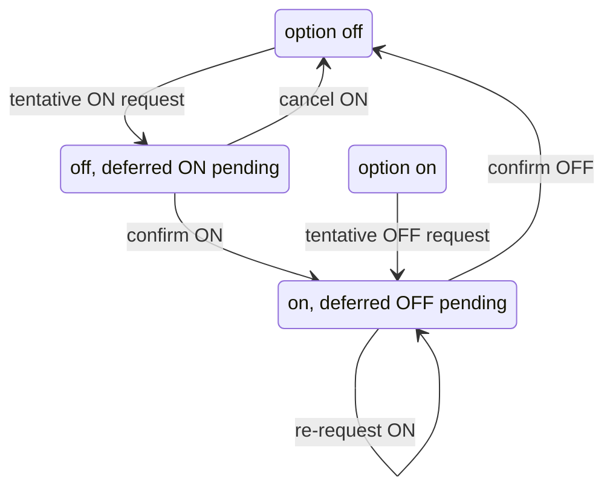

# Telnet Negotiation — Architecture

## Overview

Implements the RFC 855 option negotiation state machine and handlers for standard subnegotiation options (TTYPE, NAWS, Speed).

## 4-State Machine

## Handler Pattern

Each option handler (TTYPE, NAWS, Speed) follows a builder pattern:
1. Create with local state: `TTYPEHandler.localType("xterm")`
2. Configure callbacks: `.onRemoteType(callback)`
3. Handle subnegotiation data: `handler.handle(data)`
4. Returns response bytes or null

## Design Decisions

- **Default-accept policy** — OptionNegotiator accepts all options by default; override `shouldAcceptRemote`, `shouldEnableLocal`, etc.
- **Per-handler isolation** — each handler type (TTYPE, NAWS, Speed) is independent
- **Builder callbacks** — handlers use builders with callback setters for extensibility

---

**Last Updated**: 2026-08-17
