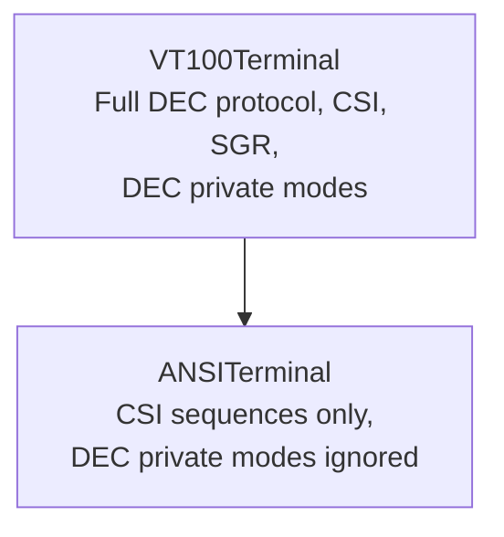

# ANSI Terminal — Architecture

This document describes the architectural decisions for the ANSI terminal module.

---

## Module Purpose

The ANSI module provides a strict ANSI X3.64 compliant terminal that filters out
DEC private mode extensions, ensuring cross-platform compatibility with
ANSI-standard applications.

## Architecture Overview



## Inheritance Chain

```
VT100Terminal → ANSITerminal
```

The ANSI terminal intercepts CSI sequences with the `?` intermediate byte
(DEC private modes) and silently ignores them, while delegating all standard
CSI sequences to VT100.

## Key Behavior

| Feature | Status |
|---------|--------|
| Standard CSI sequences | ✅ Full support (inherited from VT100) |
| DEC private modes (`ESC [ ?`) | ❌ Silently ignored |
| SGR attributes | ✅ Standard codes 0–9, 30–47 |
| Type identifier | Returns `"ansi"` |

---

**Last Updated**: 2026-08-17
