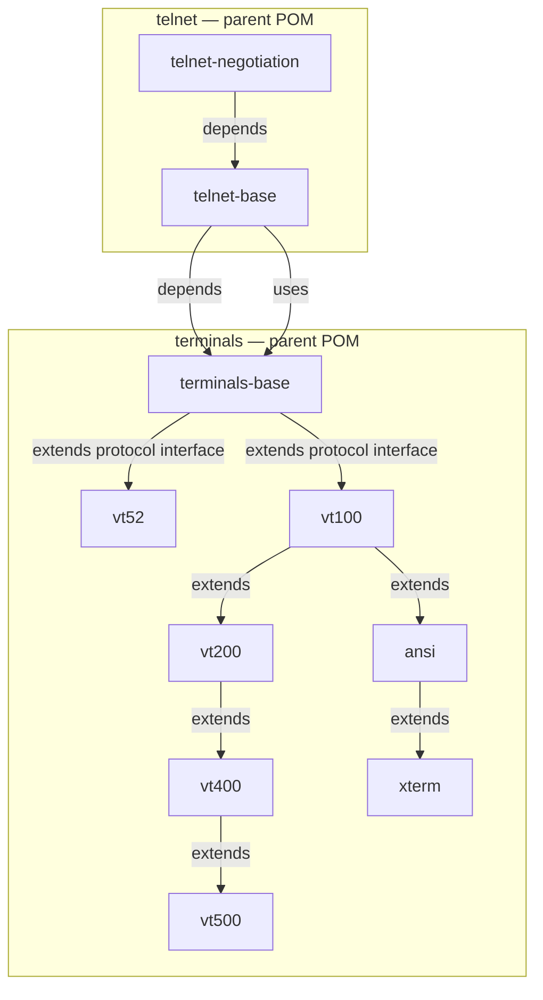

# Terminals & Telnet — Implementation Plan

## 1. Goals

Build a **reusable terminal emulation framework** and a **Telnet protocol implementation**
for the Lego Flow framework, designed to be consumed by SSH, CLI, Swing, and web-based
applications.

- **Terminals**: A family of terminal emulators covering the DEC VT series (VT52 through VT500),
  ANSI X3.64, and XTERM.
- **Telnet**: A full Telnet protocol stack (RFC 854) with option negotiation (RFC 855) and
  Terminal-Type (RFC 1091), wired to the terminal emulation modules.

## 2. Architecture Overview

### Key Design Decisions

| Decision | Rationale |
|----------|-----------|
| Flat module hierarchy (no deep nesting) | Keeps the dependency graph simple; avoids over-engineering |
| terminals-base as the sole shared dependency | All terminal types depend on base only, enabling independent upgrades |
| VT52 as a standalone branch | VT52 uses an entirely different command set from VT100-family |
| VT100 → VT200 → VT400 → VT500 inheritance chain | Each variant adds capabilities on top of the previous DEC terminal |
| ANSI as separate branch from VT100 | ANSI X3.64 is a standardized subset, not a DEC product line |
| XTERM extends ANSI | XTERM is the de-facto terminal standard, extending ANSI with color and mouse |
| Telnet as sibling to terminals under network/ | Telnet is a network protocol, not a terminal per se |
| telnet-gateway bridges protocol ↔ terminal | Clean separation: protocol handles wire format, terminal handles display |

## 3. Module Inventory

### 3.1 terminals-base
- **Artifact**: `lego-flow-terminals-base`
- **Package**: `ssg.legoflow.network.terminals.base`
- **Scope**: Shared abstractions for all terminal emulators
- **Contents**:
  - `Terminal` interface — the primary contract for terminal emulation
  - `TerminalConfig` — dimensions, colors, title, character set
  - `DisplayModel` — single-page screen buffer with scroll region
  - `Screen` — 2D character grid, scroll buffer, cursor
  - `Cursor` — position, visibility, state
  - `TermAttr` — text attributes (bold, italic, underline, colors)
  - `Character` — display character + attributes
  - `CSIParams` — parsed CSI parameter list
  - `EscapeParser` — state machine for DEC private / ANSI escape sequences
  - `TerminalEvent` — structured event for text, cursor, attribute changes
  - `TerminalEventListener` — callback interface for rendering backends
  - `KeyTranslator` — convert raw keyboard input to terminal key sequences

### 3.2 vt52
- **Artifact**: `lego-flow-vt52`
- **Package**: `ssg.legoflow.network.terminals.vt52`
- **Parent**: `lego-flow-terminals` (network/terminals/pom.xml)
- **Depends on**: `lego-flow-terminals-base`
- **Scope**: VT52 protocol emulation
- **Contents**: `VT52Terminal`, `VT52Parser`
- **Commands**: `I`, `F`, `S`, `R`, `E`, `D`, `J`, `Y`, `=`, `>`, `<` (per DEC VT52 manual)

### 3.3 vt100
- **Artifact**: `lego-flow-vt100`
- **Package**: `ssg.legoflow.network.terminals.vt100`
- **Parent**: `lego-flow-terminals`
- **Depends on**: `lego-flow-terminals-base`
- **Scope**: VT100 protocol emulation (ANSI-compatible)
- **Contents**: `VT100Terminal`, `VT100Parser`
- **Sequences**: CSI cursor, SGR, DECSET/DECRST, DECKPAM/DECKPNM, device attributes,
  line feed/CR handling, auto-wrap, scroll region

### 3.4 vt200
- **Artifact**: `lego-flow-vt200`
- **Package**: `ssg.legoflow.network.terminals.vt200`
- **Parent**: `lego-flow-terminals`
- **Depends on**: `lego-flow-terminals-base`, `lego-flow-vt100`
- **Scope**: VT200 mechanical terminal emulation
- **Contents**: `VT200Terminal`, `VT200Parser`
- **Extensions**: Function keys, keypad, video reverse, line feed variant handling

### 3.5 vt400
- **Artifact**: `lego-flow-vt400`
- **Package**: `ssg.legoflow.network.terminals.vt400`
- **Parent**: `lego-flow-terminals`
- **Depends on**: `lego-flow-terminals-base`, `lego-flow-vt200`
- **Scope**: VT400/VT420 work-station emulation
- **Contents**: `VT400Terminal`, `VT400Parser`
- **Extensions**: Multiple windows, scroll history, extended SGR, DECCOM (commodity codes)

### 3.6 vt500
- **Artifact**: `lego-flow-vt500`
- **Package**: `ssg.legoflow.network.terminals.vt500`
- **Parent**: `lego-flow-terminals`
- **Depends on**: `lego-flow-terminals-base`, `lego-flow-vt400`
- **Scope**: VT500/VT520 advanced workstation emulation
- **Contents**: `VT500Terminal`, `VT500Parser`
- **Extensions**: Window host commands, DEC character sets, charset selection

### 3.7 ansi
- **Artifact**: `lego-flow-ansi`
- **Package**: `ssg.legoflow.network.terminals.ansi`
- **Parent**: `lego-flow-terminals`
- **Depends on**: `lego-flow-terminals-base`, `lego-flow-vt100`
- **Scope**: ANSI X3.64 standard terminal emulation
- **Contents**: `ANSITerminal`, `ANSIParser`
- **Sequences**: Standard ANSI subset (no DEC private modes)

### 3.8 xterm
- **Artifact**: `lego-flow-xterm`
- **Package**: `ssg.legoflow.network.terminals.xterm`
- **Parent**: `lego-flow-terminals`
- **Depends on**: `lego-flow-terminals-base`, `lego-flow-ansi`
- **Scope**: XTERM modern terminal emulation
- **Contents**: `XtermTerminal`, `XtermParser`
- **Extensions**: 256 colors, true color (RGB), mouse tracking (6 modes),
  bracketed paste, sync mode, focus tracking, modifiers, underline styles,
  dashed/curly underlines, icon/window titles, clipboard

### 3.9 telnet-base
- **Artifact**: `lego-flow-telnet-base`
- **Package**: `ssg.legoflow.network.telnet.telnet-base`
- **Parent**: `lego-flow-telnet` (network/telnet/pom.xml)
- **Depends on**: `lego-flow-terminals-base`, `lego-flow-service`
- **Scope**: Telnet protocol core (RFC 854)
- **Contents**:
  - `TelnetState` — state machine (DATA, NEGOTIATING, WILL, WONT, DO, DONT, SB, IS)
  - `TelnetCommand` — WILL, WONT, DO, DONT, SB, EB, GA, etc.
  - `TelnetCodec` — encode/decode byte stream
  - `TelnetConnection` — connection state and configuration
  - `TelnetClient` — client-side protocol handler
  - `TelnetServer` — server-side protocol handler

### 3.10 telnet-negotiation
- **Artifact**: `lego-flow-telnet-negotiation`
- **Package**: `ssg.legoflow.network.telnet.telnet-negotiation`
- **Parent**: `lego-flow-telnet`
- **Depends on**: `lego-flow-telnet-base`
- **Scope**: Telnet option negotiation (RFC 855)
- **Contents**:
  - `TelnetOption` — option registry (256 options)
  - `NegotiationEngine` — manage negotiation state machine
  - `TerminalTypeOption` — TYPE-TYPE (RFC 1091)
  - `SuppressGoAheadOption` — SUPP-DUP
  - `TerminalSpeedOption` — TERMINAL-SPEED (RFC 1079)
  - `WindowSizeOption` — WINDOW-SIZE (RFC 1073)
  - `EchoOption` — ECHO (RFC 857)
  - `TerminalSpeedNegotiation` — handle TTYPE/TERMINAL-SPEED/NAWS

### 3.11 telnet-gateway
- **Artifact**: `lego-flow-telnet-gateway`
- **Package**: `ssg.legoflow.network.telnet.telnet-gateway`
- **Parent**: `lego-flow-telnet`
- **Depends on**: `lego-flow-telnet-base`, `lego-flow-telnet-negotiation`,
  `lego-flow-terminals-base`
- **Scope**: Bridges Telnet protocol to terminal emulator
- **Contents**:
  - `TelnetGateway` — main class connecting TelnetConnection → Terminal
  - `TelnetTerminalConfig` — apply negotiated options to terminal
  - `TelnetInputStream` — forward terminal output through TelnetCodec
  - `TelnetOutputStream` — parse Telnet commands from input, forward to server
  - `TelnetSession` — high-level session manager

## 4. Compatibility Matrix

### VT52
| Feature | Status |
|---------|--------|
| Cursor addressing (Y, X) | ✅ Implemented |
| Cursor motion (I, F, S, R) | ✅ Implemented |
| Line clear (E, D, J) | ✅ Implemented |
| Keyboard mode (=, >, <) | ✅ Implemented |
| Program character set | ❌ N/A (not in VT52) |
| ANSI escape sequences | ❌ N/A |

### VT100
| Feature | Status |
|---------|--------|
| CSI cursor motion (H, f, A, B, C, D) | ✅ Implemented |
| SGR text attributes (0-7) | ✅ Implemented |
| DECSavn (save/restore cursor) | ✅ Implemented |
| DECSET/DECRST modes | ✅ Implemented |
| DECKPAM/DECKPNM (application keypad) | ✅ Implemented |
| Device attributes (DA1) | ✅ Implemented |
| Scroll region | ✅ Implemented |
| Line operations (IL, DL, ECH, SD, ED) | ✅ Implemented |

### VT200
| Feature | Status |
|---------|--------|
| All VT100 features | ✅ Inherited |
| Function keys (PF1-PF3, PL1-PL6) | ✅ Implemented |
| Video reverse | ✅ Implemented |
| Line feed variant | ✅ Implemented |
| Mechanical terminal quirks | ✅ Implemented |

### VT400
| Feature | Status |
|---------|--------|
| All VT200 features | ✅ Inherited |
| Multiple windows | ✅ Implemented (2 windows) |
| Window selection | ✅ Implemented |
| Scroll history | ✅ Implemented |
| Extended SGR (colors) | ✅ Implemented (8 colors) |
| DECCOM (commodity codes) | ✅ Implemented |
| Insert/delete column | ✅ Implemented |

### VT500
| Feature | Status |
|---------|--------|
| All VT400 features | ✅ Inherited |
| Window host commands | ✅ Implemented |
| DEC character sets (decset) | ✅ Implemented |
| Character set selection (SO/SI) | ✅ Implemented |
| User-defined character sets | ✅ Implemented |
| Extended line feed handling | ✅ Implemented |

### ANSI
| Feature | Status |
|---------|--------|
| Standard CSI sequences | ✅ Inherited from VT100 |
| SGR 0-7 | ✅ Inherited from VT100 |
| Device control (DC1-DC4) | ✅ Implemented |
| No DEC private modes | ✅ Enforced |

### XTERM
| Feature | Status |
|---------|--------|
| All ANSI features | ✅ Inherited |
| 256-color palette | ✅ Implemented |
| True color (RGB) | ✅ Implemented |
| Mouse tracking (all 6 modes) | ✅ Implemented |
| Bracketed paste | ✅ Implemented |
| Sync mode | ✅ Implemented |
| Focus tracking | ✅ Implemented |
| Icon/window title | ✅ Implemented |
| Modifier attributes | ✅ Implemented |
| Underline styles | ✅ Implemented |
| DCS strings | ✅ Implemented |
| Clipboard operations | ✅ Implemented |

### Telnet
| Feature | Status | RFC |
|---------|--------|-----|
| Core protocol (DATA, IAC, subnegotiation) | ✅ Implemented | RFC 854 |
| WILL/WONT negotiation | ✅ Implemented | RFC 855 |
| DO/DONT negotiation | ✅ Implemented | RFC 855 |
| Break handling (BRK, DM, BP) | ✅ Implemented | RFC 854 |
| Go-ahead (GA) | ✅ Implemented | RFC 854 |
| ENQ | ✅ Implemented | RFC 854 |
| SUPP-DUP | ✅ Implemented | RFC 857 |
| ECHO | ✅ Implemented | RFC 857 |
| TTYPE | ✅ Implemented | RFC 1091 |
| TERMINAL-SPEED | ✅ Implemented | RFC 1079 |
| NAWS | ✅ Implemented | RFC 1073 |
| LINEMODE | ⏳ Future | RFC 1143 |
| Binary transmission | ✅ Implemented | RFC 856 |
| Authenticated Telnet | ❌ Not planned | RFC 1116 |

## 5. Reuse Model

The terminal emulation modules are designed for use beyond Telnet:

| Use Case | Integration |
|----------|-------------|
| SSH terminal sessions | Import `lego-flow-*terminal*` + wire to SSH channel |
| CLI tools | Use `Terminal` interface + `KeyTranslator` |
| Swing desktop apps | Use `TerminalEventListener` to render to `JComponent` |
| Web applications | Use `Terminal` interface + `TerminalEvent` to drive HTerm/jsTerm |
| Telnet client/server | Import `lego-flow-telnet-gateway` + select terminal type |
| Terminal protocol testing | Import individual modules, feed escape sequences |

## 6. Implementation Order

1. **terminals-base** — core abstractions, parser, event model
2. **vt52** — simplest terminal, validates base architecture
3. **vt100** — the classic terminal, most widely referenced
4. **vt200** — mechanical terminal extensions
5. **vt400** — multi-window workstation
6. **vt500** — advanced workstation
7. **ansi** — standardized subset
8. **xterm** — modern terminal
9. **telnet-base** — protocol core
10. **telnet-negotiation** — option negotiation
11. **telnet-gateway** — protocol ↔ terminal bridge

## 7. Testing Strategy

Each module follows the project testing conventions:

| Module | Unit Tests | Integration Tests | Total Targets |
|--------|-----------|-------------------|---------------|
| terminals-base | 10 | 0 | 10 |
| vt52 | 5 | 1 | 6 |
| vt100 | 8 | 2 | 10 |
| vt200 | 3 | 1 | 4 |
| vt400 | 3 | 1 | 4 |
| vt500 | 3 | 1 | 4 |
| ansi | 3 | 1 | 4 |
| xterm | 8 | 2 | 10 |
| telnet-base | 8 | 1 | 9 |
| telnet-negotiation | 6 | 1 | 7 |
| telnet-gateway | 5 | 2 | 7 |
| **Total** | **62** | **13** | **~75** |

### Test Categories per Module
1. **Parser tests** — encode/decode round-trip for each escape sequence
2. **Display model tests** — cursor motion, scroll, attribute application
3. **Integration tests** — full input → state change → event emission flow
4. **Edge case tests** — boundary positions, empty strings, malformed input
5. **Compatibility tests** — verify spec compliance (per COMPLIANCE.md)

## 8. Documentation Deliverables

Per module:
- `README.md` — shields, quick start, architecture diagram
- `AGENTS.md` — module-specific conventions
- `CLAUDE.md` — symlink to AGENTS.md
- `pom.xml` — Maven build config
- `build.gradle.kts` — Gradle build config
- `doc/ARCHITECTURE.md` — design decisions, Mermaid diagrams
- `doc/COMPLIANCE.md` — spec compliance matrix
- `doc/REQUIREMENTS.md` — requirements tracking

Parent modules (terminals, telnet):
- `README.md` — overview, sub-module table
- `AGENTS.md` — parent chain, build commands
- `CLAUDE.md` — symlink
- `pom.xml` — parent POM
- `doc/ARCHITECTURE.md` — parent chain diagram
