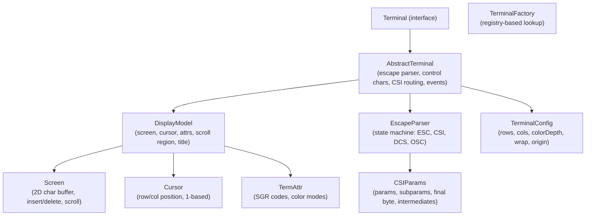
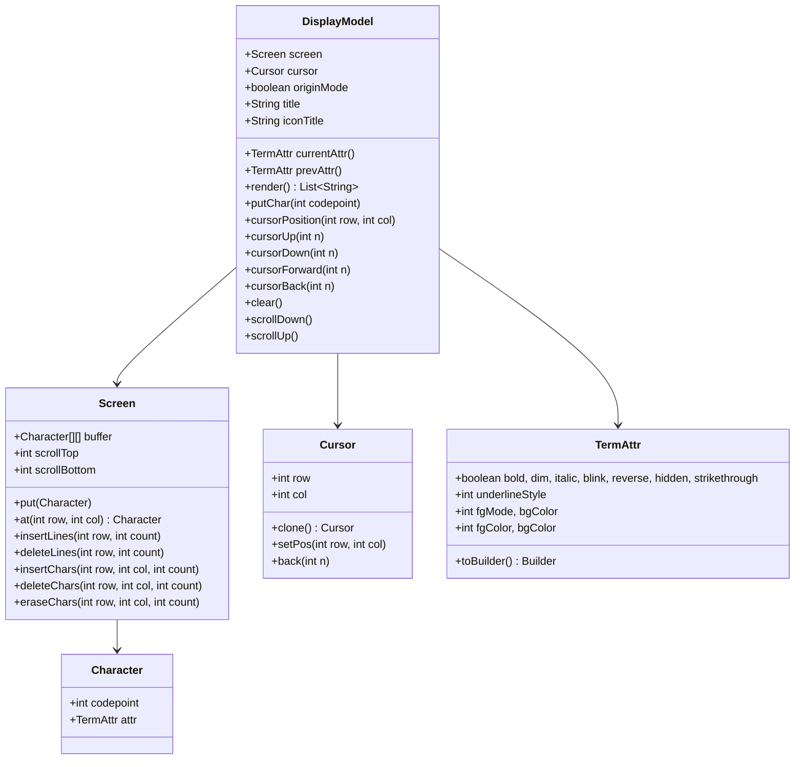
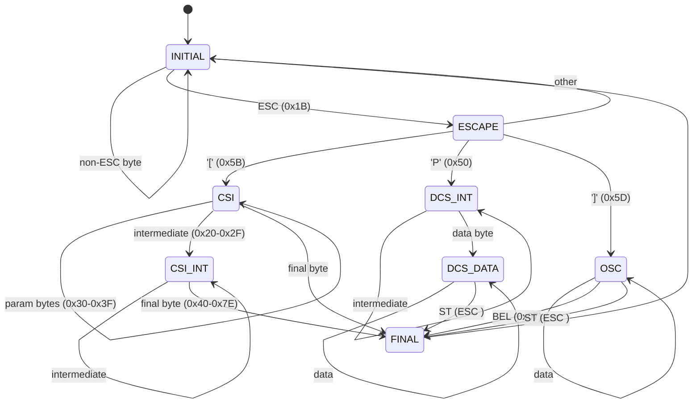

# Terminals Base — Architecture

This document describes the architectural decisions for the terminals-base module.

---

## Module Purpose

The terminals-base module is the foundation of the terminal emulation framework. It provides the core abstractions that all terminal type implementations share: display rendering, cursor management, text attributes, escape sequence parsing, and the `Terminal` contract.

## Architecture Overview

## Display Model

The `DisplayModel` is the central state holder. It contains:

## Escape Parser State Machine

## CSI Parameter Parsing

The parser handles the full CSI parameter format:
- Parameters are digits (0x30-0x39)
- Parameters are separated by semicolon (0x3B)
- Subparameters are separated by colon (0x3A) — XTERM extension
- Missing parameters default to sentinel (-1), resolved to 0 at emission time
- Intermediates (0x20-0x2F) modify meaning (e.g., `?` for DEC private modes)
- Final byte (0x40-0x7E) dispatches the handler

## Design Decisions

- **Immutable config**: `TerminalConfig` is immutable; changes require creating a new config
- **1-based indexing**: Cursor positions and screen coordinates use 1-based indexing (row 1, col 1 = top-left), matching terminal convention
- **Sentinel-based defaults**: CSI params use -1 as internal sentinel, resolved to 0 at emission, matching VT100 behavior where `CSI J` (erase display) defaults parameter to 0
- **Builder pattern**: `TermAttr` uses builder for fluent attribute construction
- **Registry-based factory**: `TerminalFactory` avoids compile-time cross-module dependencies; implementations register themselves at runtime
- **Event-driven**: `TerminalEventListener` allows external renderers to react to display changes without polling
- **Display separation**: `DisplayModel` holds all visual state, making it easy to swap renderers or inspect state

## Integration with Lego Flow

| Lego Flow Module | Usage in Terminals |
|------------------|-------------------|
| `blocks` | No direct dependency; terminals are stateful and self-contained |

## Thread Safety Model

- Terminals are **not thread-safe** by design
- All operations should occur on a single thread (e.g., the protocol handler thread)
- `listeners` list uses `CopyOnWriteArrayList` for safe iteration during event dispatch
- Rendering backends should synchronize access to terminal state

---

## Related Documentation

- [Module README](../README.md) | [Requirements](REQUIREMENTS.md)
- [Root AGENTS.md](../../../../AGENTS.md)

---

**Last Updated**: 2026-08-17
