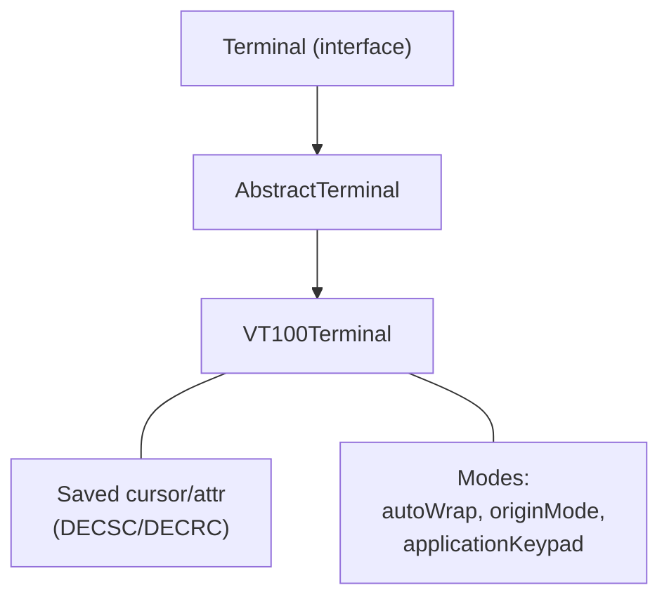
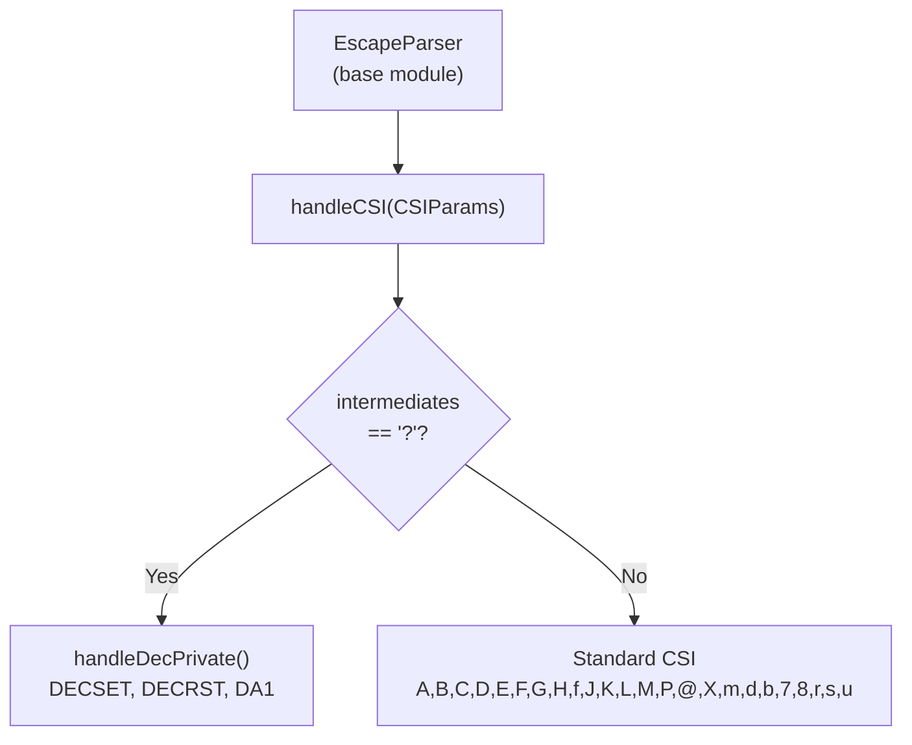

# VT100 Terminal — Architecture

## Overview

The VT100 terminal emulator extends `AbstractTerminal` with VT100-specific CSI handling, DEC private mode support, and comprehensive SGR text attribute processing.

## Inheritance Chain

## CSI Handling Flow

## SGR Processing

SGR parameters are processed sequentially. Each code modifies the current `TermAttr.Builder`. The builder accumulates changes and applies the final result to the display model. Multi-value SGR sequences (e.g., `CSI 1;31;42m`) are handled in a single pass.

## Design Decisions

- **Extends AbstractTerminal** — reuses escape parser and control char handling
- **Protected constructor** — allows subclass extension (VT200, VT400, ANSITerminal)
- **Saved cursor/attr** — DECSC (CSI 7) and DECRC (CSI 8) for cursor save/restore
- **Bright colors** — SGR 90-97 and 100-107 mapped to 8-color indices 8-15
- **No 256/RGB** — XTERM adds this; VT100 only supports 8 basic colors

---

**Last Updated**: 2026-08-17
