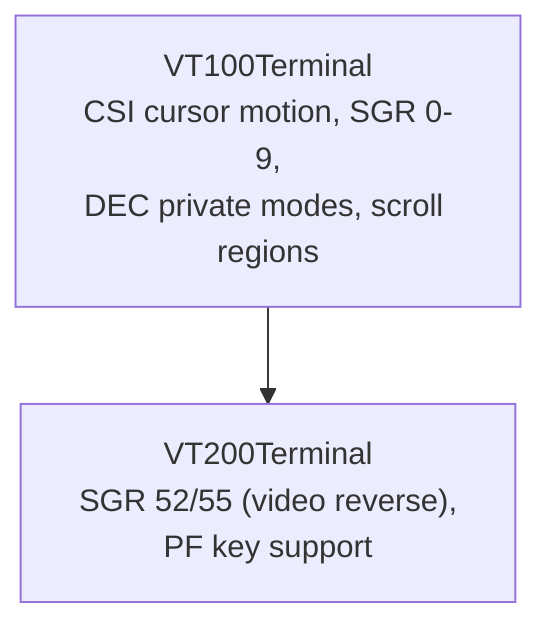

# VT200 Terminal — Architecture

This document describes the architectural decisions for the VT200 terminal module.

---

## Module Purpose

The VT200 module extends VT100 with video reverse mode and function key support,
providing compatibility with DEC VT200/VT220 mechanical terminals.

## Architecture Overview



## Inheritance Chain

```
VT100Terminal → VT200Terminal
```

The VT200 intercepts SGR parameter 52 (video reverse on) and 55 (video reverse off)
before delegating all other CSI sequences to VT100.

## Key Abstractions

| Feature | Implementation |
|---------|---------------|
| Video Reverse | `videoReverse` boolean flag, toggled via SGR 52/55 |
| Function Keys | PF1–PF3, PL1–PL6 key translations |
| Reset | Video reverse cleared on reset |

---

**Last Updated**: 2026-08-17
