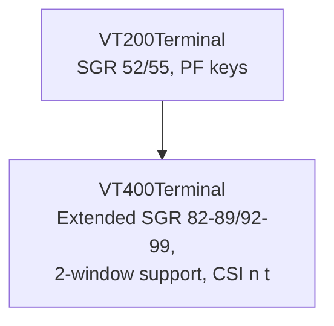

# VT400 Terminal — Architecture

This document describes the architectural decisions for the VT400 terminal module.

---

## Module Purpose

The VT400 module extends VT200 with workstation capabilities including
extended SGR color codes and multi-window support for DEC VT400/VT420 terminals.

## Architecture Overview



## Inheritance Chain

```
VT100Terminal → VT200Terminal → VT400Terminal
```

## Window Model

The VT400 supports 2 windows. Window selection via `CSI n t` switches the active
window (1 or 2). Reset defaults to window 1.

## Extended SGR

| Code | Meaning |
|------|---------|
| 82–89 | Extended foreground colors |
| 92–99 | Extended background colors |

---

**Last Updated**: 2026-08-17
