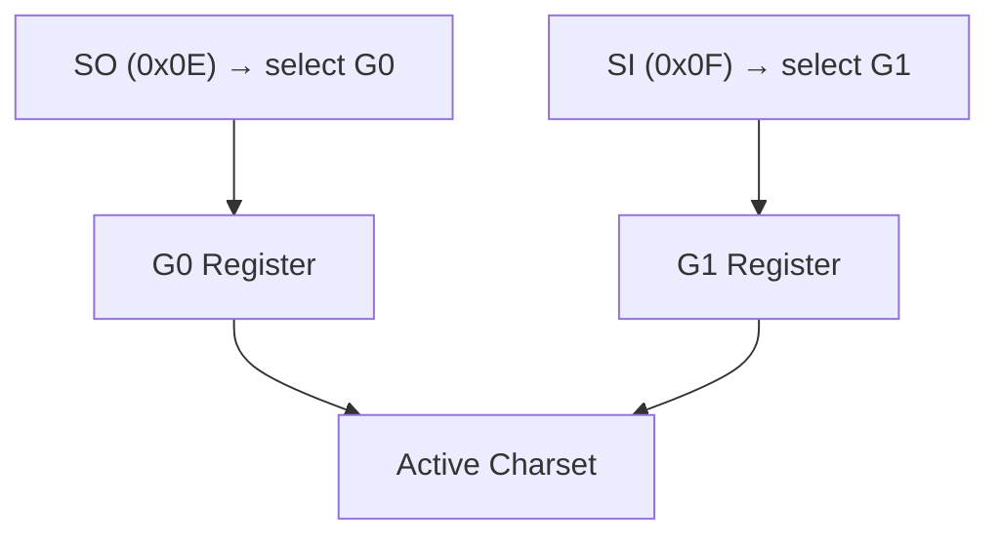

# VT500 Terminal — Architecture

## Overview

Extends VT400 with DEC character set selection via SO/SI and G0/G1 charset registers.

## Inheritance

```
VT100Terminal → VT200Terminal → VT400Terminal → VT500Terminal
```

## Character Set Model



---

**Last Updated**: 2026-08-17
