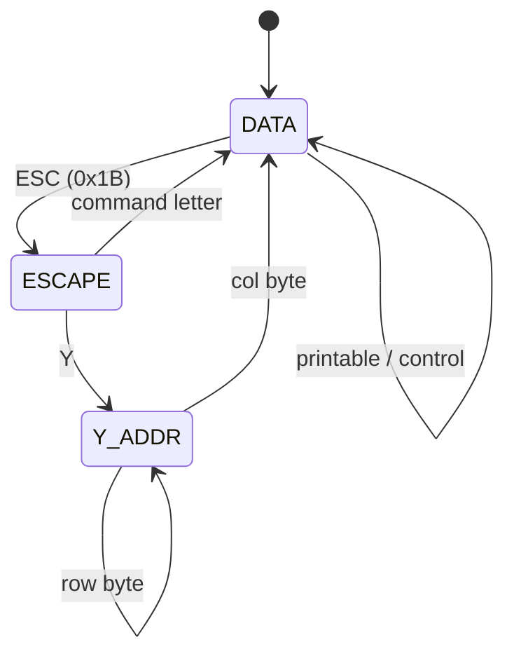

# VT52 Terminal — Architecture

## Overview

The VT52 is the simplest DEC terminal, using an entirely different command set from the VT100 family. It does NOT use CSI sequences — instead, commands are ESC followed by a single letter.

## State Machine

## Cursor Addressing

VT52 uses printable ASCII for cursor addressing:
- Row/Col = value + 32 (so row 1 = '@' = 0x40)
- Sequence: ESC Y (row+32) (col+32)
- Range: 1–255 for both axes

## Design Decisions

- **Independent parser** — VT52 does not share the EscapeParser with VT100; it has its own minimal state machine
- **No color** — VT52Terminal.supportsColor() returns false
- **No attributes** — uses DisplayModel but only for cursor and character placement
- **Extends DisplayModel** — reuses screen buffer and cursor from base module

---

**Last Updated**: 2026-08-17
