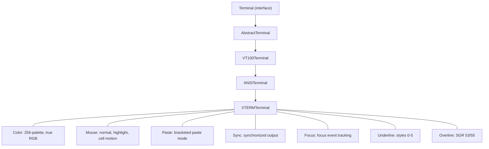
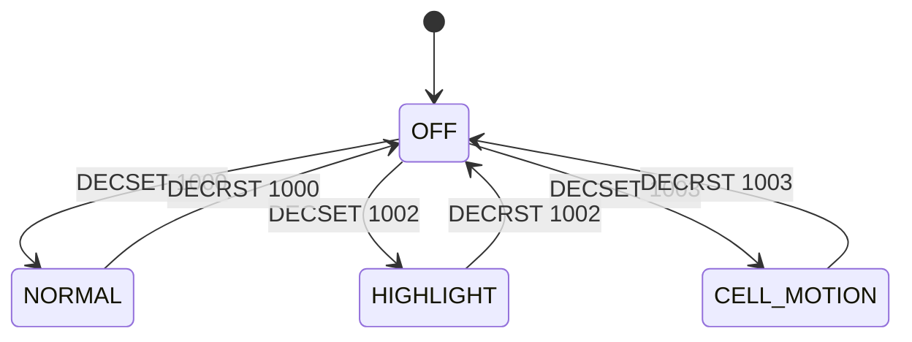

# XTERM Terminal — Architecture

## Overview

The XTERM terminal emulator extends ANSI/VT100 with modern terminal features. It is the most feature-rich terminal in the hierarchy.

## Inheritance

## Extended SGR Processing

XTERM reinterprets SGR parameters 38/48 to handle extended color:
- `38;5;n` — 256-color palette index
- `38;2;r;g;b` — true RGB color
- Same pattern for background (48;5;n, 48;2;r;g;b)

The handler uses subparameter-aware parsing: after consuming 38 or 48, it reads the next parameter to determine the mode (5 for 256-color, 2 for RGB).

## Mouse Mode Model

---

**Last Updated**: 2026-08-17
