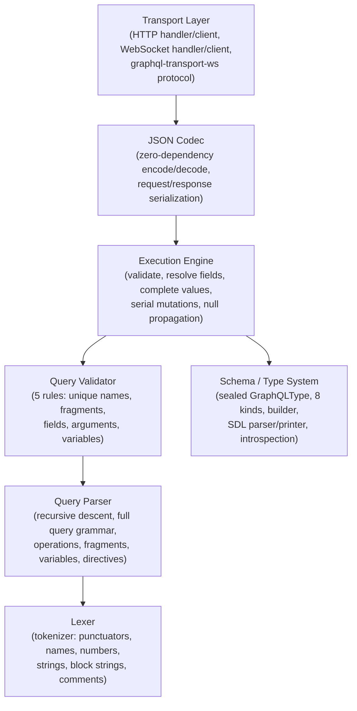
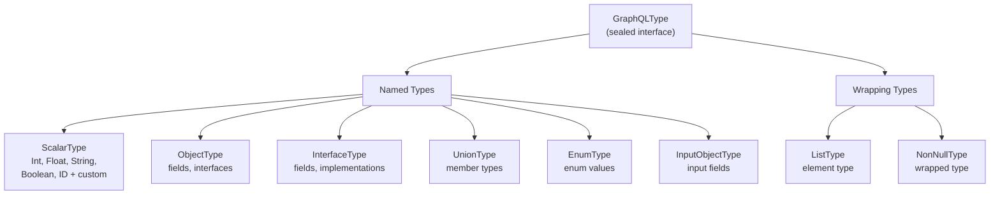
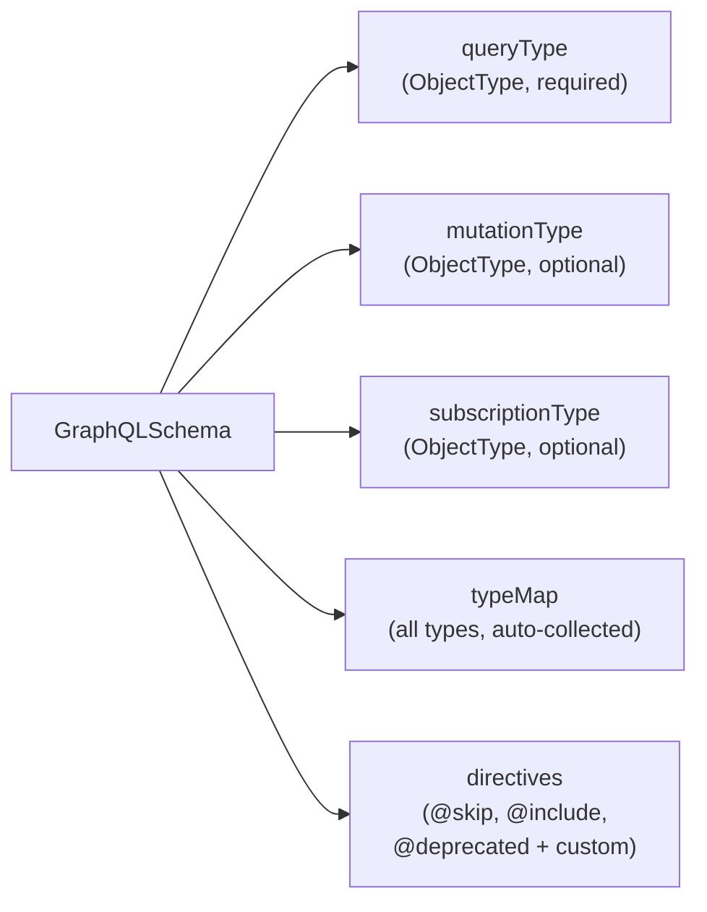
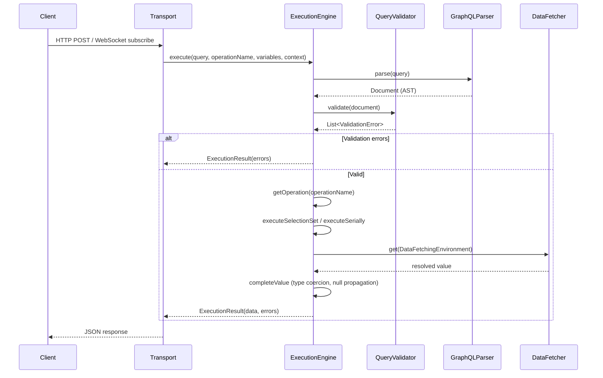
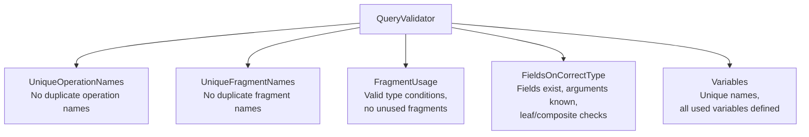
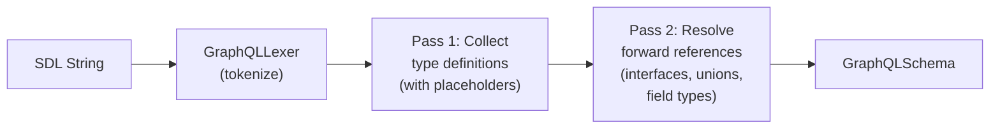
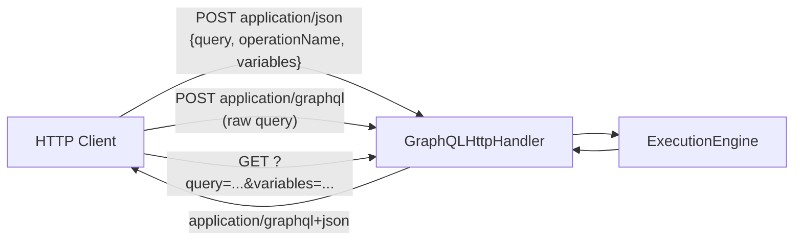
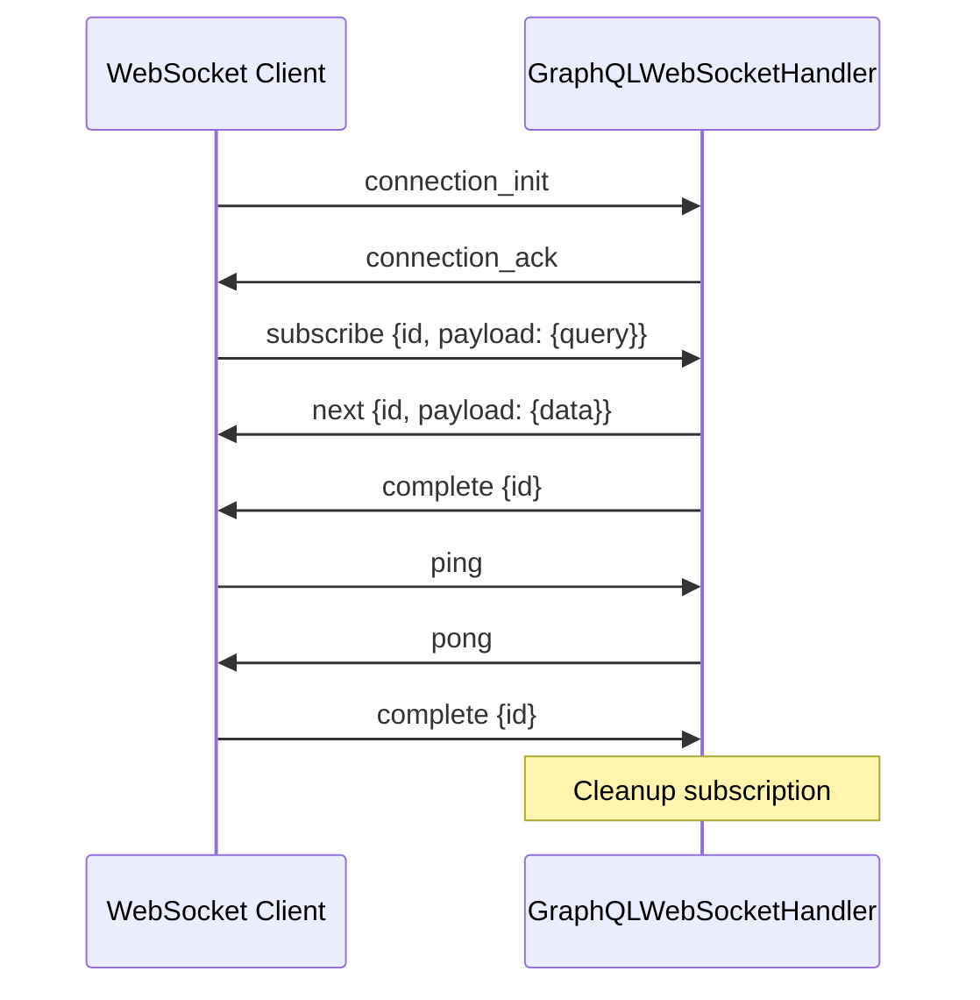

# GraphQL Module -- Architecture

This document describes the architectural decisions for the GraphQL module.

---

## Protocol Overview

GraphQL is a query language for APIs and a runtime for fulfilling those queries with existing data. Unlike REST, clients specify exactly the data they need. The Lego Flow implementation provides a complete GraphQL engine: schema definition, query parsing, validation, execution, introspection, and transport bindings for HTTP and WebSocket.

## Layered Architecture

## Type System Architecture

The type system uses a sealed interface (`GraphQLType`) with pattern matching, allowing exhaustive `switch` expressions throughout the codebase.

### Schema Composition

The `GraphQLSchema.Builder` collects root types and additional types. During `build()`, it traverses all root type fields recursively to auto-discover referenced types, registers interface implementations on `InterfaceType` instances, and adds built-in scalars and directives.

## Query Processing Pipeline

## Execution Engine Details

### Field Resolution

For each field in a selection set:
1. **Collect fields** -- merge fields with the same response name (aliases), expand fragment spreads and inline fragments, apply `@skip`/`@include` directives
2. **Resolve arguments** -- apply defaults from field definition, substitute variables
3. **Call data fetcher** -- invoke the field's `DataFetcher`, or fall back to the default property-based fetcher
4. **Complete value** -- coerce result according to the field type:
   - **NonNull**: propagate null upward on null result
   - **List**: iterate and complete each element
   - **Scalar**: call `serialize()` on the scalar type
   - **Enum**: validate the value against enum entries
   - **Object**: recurse into sub-selection set
   - **Interface/Union**: resolve to concrete `ObjectType`, then recurse

### Abstract Type Resolution

When a field returns an interface or union type, the engine resolves the concrete type via:
1. `__typename` key in the result Map
2. Java class name matching against possible types
3. Single possible type (if only one member)
4. First possible type as fallback

### Default Data Fetcher

When no explicit `DataFetcher` is set, the engine resolves field values from the source object by trying (in order):
1. `Map.get(fieldName)` for Map sources
2. `source.fieldName()` method
3. `source.getFieldName()` method
4. `source.isFieldName()` method (for booleans)
5. `source.fieldName` public field

## Validation Architecture

The `QueryValidator` applies 5 default rules, each implemented as a `ValidationRule` functional interface:

Custom rules can be provided via the `QueryValidator(schema, rules)` constructor.

## SDL Parser Architecture (Two-Pass)

The `SchemaParser` converts SDL strings to `GraphQLSchema` in two passes:

- **Pass 1**: Parses all type definitions (schema, scalar, type, interface, union, enum, input, directive) and stores them in a registry. Uses placeholder `ScalarType` for types not yet defined (forward references).
- **Pass 2**: Resolves object type interfaces, union member types, and rebuilds objects/fields with resolved type references.

## Introspection System

The introspection system adds `__schema` and `__type` query fields with data fetchers that build map representations of the schema. It defines 8 introspection types:

| Type | Purpose |
|------|---------|
| `__Schema` | Root introspection: types, queryType, mutationType, subscriptionType, directives |
| `__Type` | Describes a type: kind, name, fields, interfaces, possibleTypes, enumValues, inputFields, ofType |
| `__Field` | Describes a field: name, args, type, isDeprecated, deprecationReason |
| `__InputValue` | Describes an argument or input field: name, type, defaultValue |
| `__EnumValue` | Describes an enum value: name, isDeprecated, deprecationReason |
| `__Directive` | Describes a directive: name, locations, args |
| `__TypeKind` | Enum: SCALAR, OBJECT, INTERFACE, UNION, ENUM, INPUT_OBJECT, LIST, NON_NULL |
| `__DirectiveLocation` | Enum: all 19 directive locations (executable + type system) |

## Transport Architecture

### HTTP Transport

### WebSocket Transport (graphql-transport-ws)

The WebSocket handler maintains a `ConcurrentHashMap` of active subscriptions keyed by subscription ID, with `Runnable` unsubscribe callbacks for cleanup.

## Integration with Lego Flow

| Lego Flow Module | Usage in GraphQL |
|------------------|-----------------|
| `http` | `HttpRequestHandler` for `GraphQLHttpHandler`, `WebSocketSession` / `WebSocketFrame` for WebSocket transport |

The GraphQL module uses the HTTP module's request handler and WebSocket session interfaces for transport binding. The execution engine and type system are standalone with no framework dependencies.

---

## Related Documentation

- [Module README](../README.md) | [Requirements](REQUIREMENTS.md) | [Compliance](COMPLIANCE.md)
- [Root Architecture](../../../doc/ARCHITECTURE.md) | [Root README](../../../README.md)

---

**Last Updated**: 2026-07-06
