# gRPC Module -- Architecture

This document describes the architectural decisions for the gRPC module.

---

## Protocol Overview

gRPC is a high-performance RPC framework using HTTP/2 for transport and Protocol Buffers for message serialization. The Lego Flow implementation provides a pure-JDK gRPC stack with runtime protobuf encoding -- no `.proto` file compilation or code generation required. All message and service descriptors are built programmatically.

## Layered Architecture

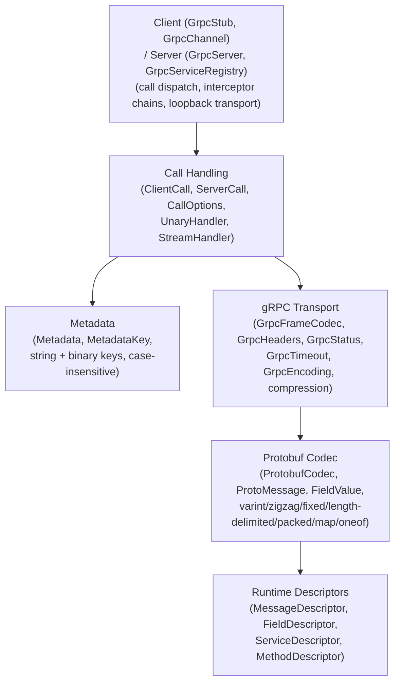

## Protobuf Wire Format

The protobuf layer encodes and decodes binary protobuf messages from scratch, supporting all standard wire types:

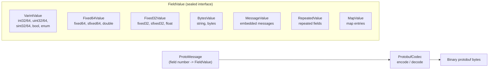

### Encoding Details

| Encoding | Wire Type | Field Types |
|----------|-----------|-------------|
| Varint (LEB128) | 0 | int32, int64, uint32, uint64, bool, enum |
| ZigZag + Varint | 0 | sint32, sint64 |
| Fixed 32-bit LE | 5 | fixed32, sfixed32, float |
| Fixed 64-bit LE | 1 | fixed64, sfixed64, double |
| Length-delimited | 2 | string, bytes, embedded message, packed repeated |

### Runtime Descriptor System

Instead of compiled `.proto` files, descriptors are built at runtime:

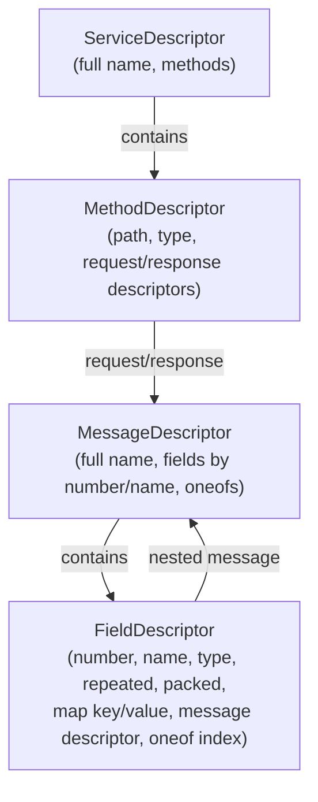

## gRPC Frame Format

Messages are framed with a 5-byte header for transmission over HTTP/2:

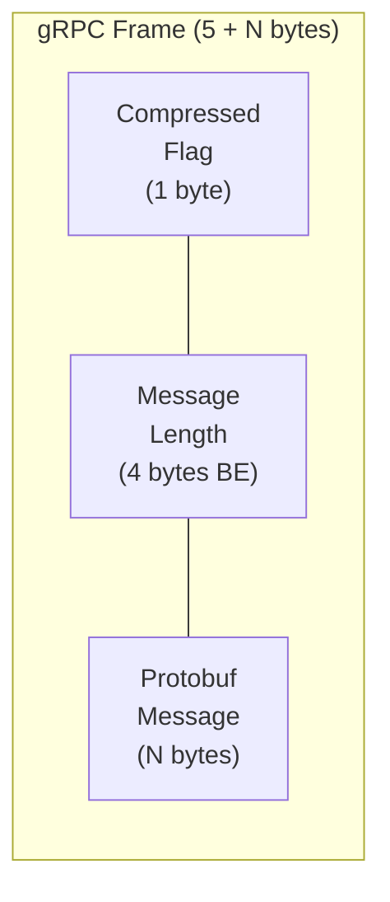

- Compressed flag: `0` = identity, `1` = compressed (gzip or deflate)
- Length: 4-byte big-endian unsigned integer
- Default max message size: 4 MB
- Compression support: identity, gzip, deflate

## Request/Response Flow

### Unary Call

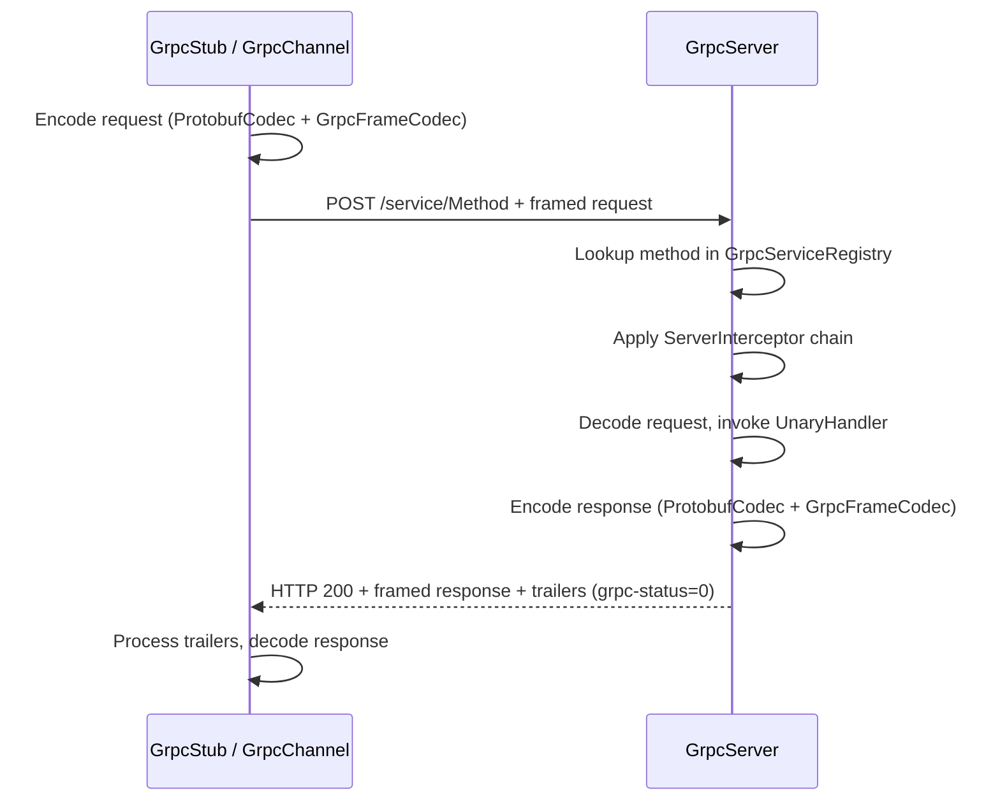

### Server Streaming Call

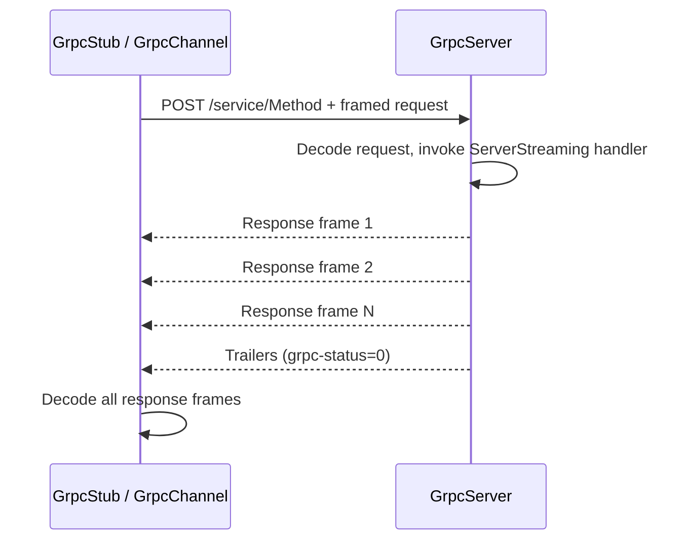

### Client Streaming Call

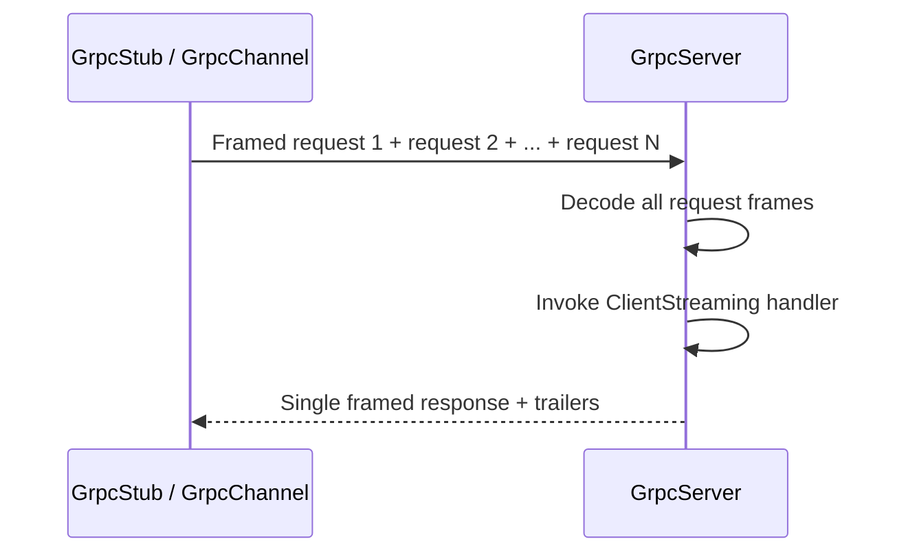

### Bidi Streaming Call

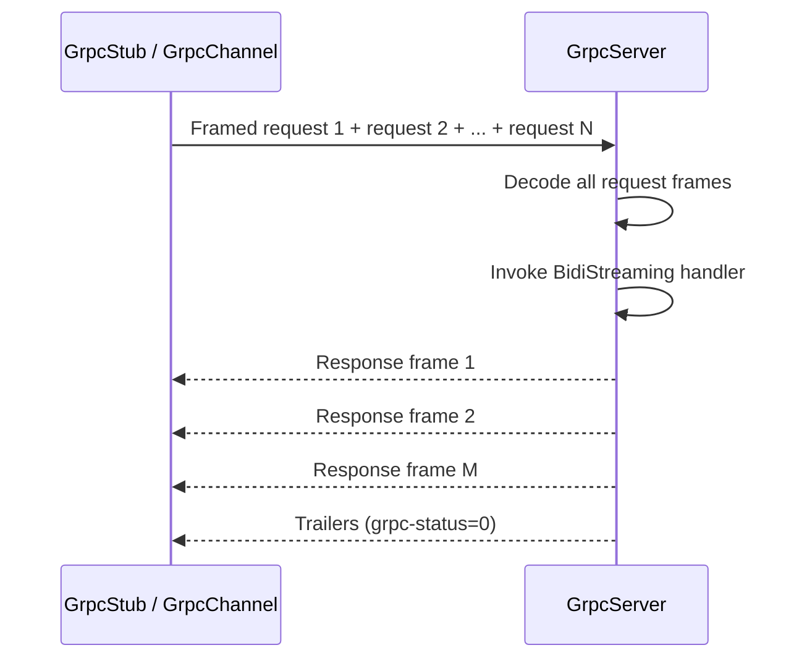

## Server Architecture

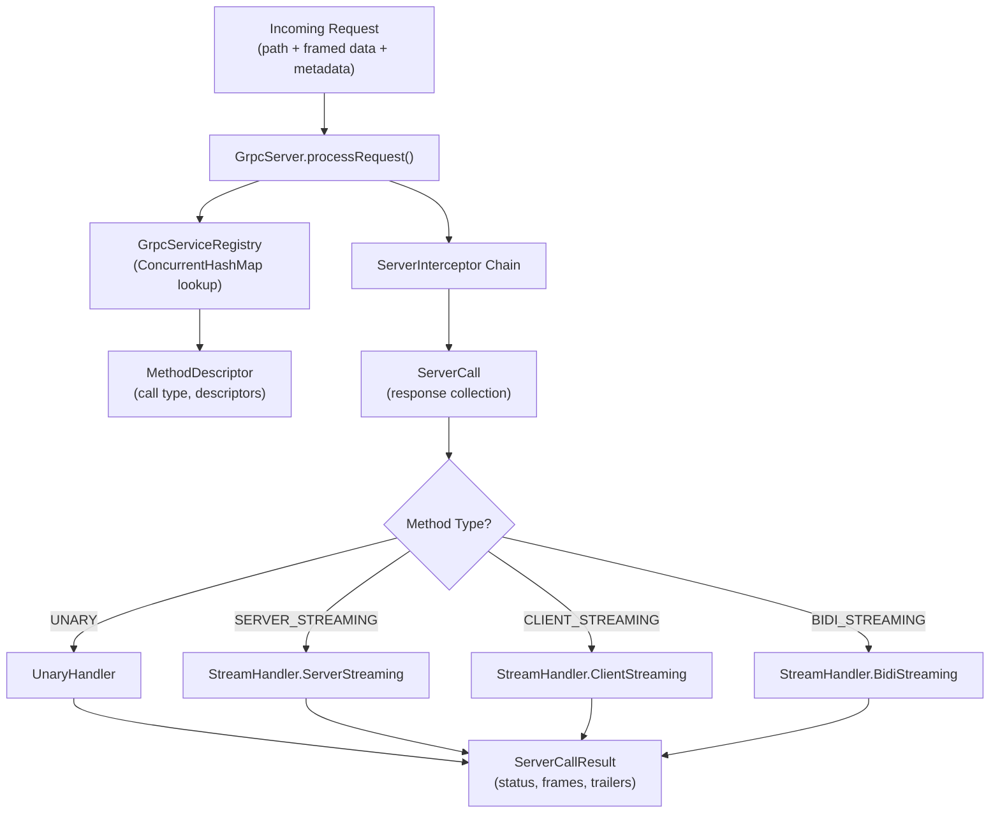

## Client Architecture

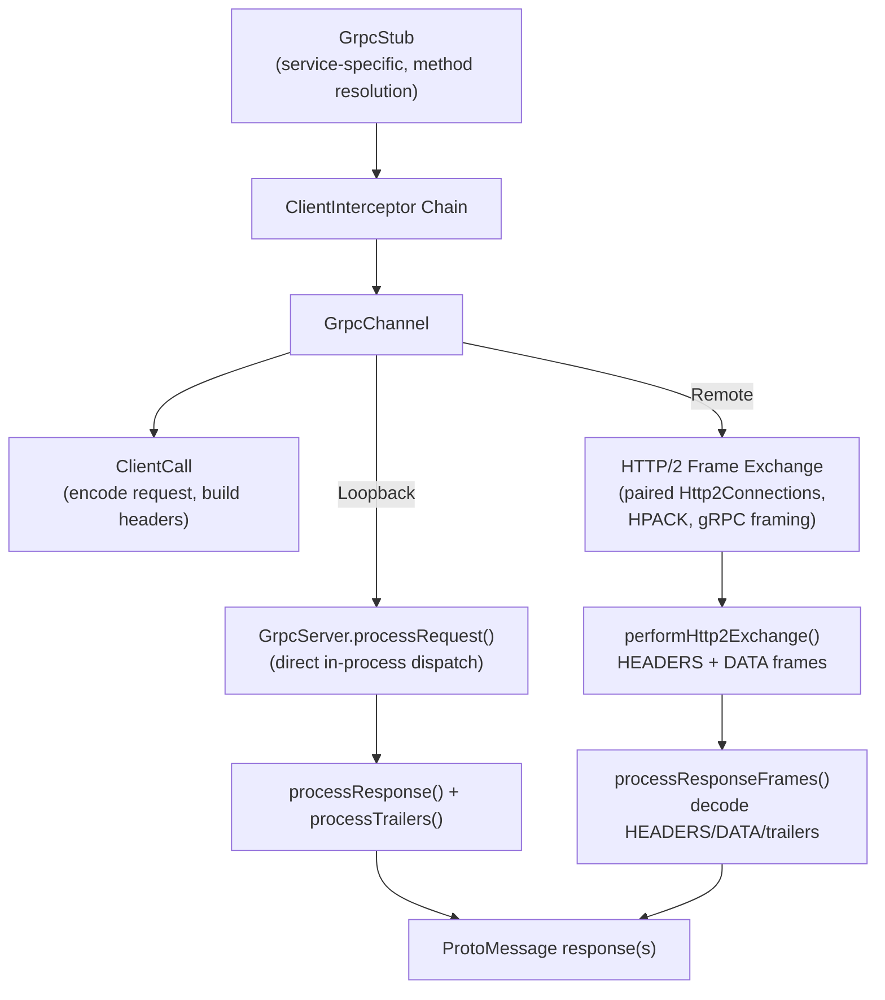

- **Loopback mode**: `GrpcChannel(server)` dispatches directly to `GrpcServer.processRequest()`, enabling full end-to-end testing without network I/O
- **Remote mode**: `GrpcChannel(authority)` constructs paired client/server `Http2Connection` instances, exchanges connection preface and SETTINGS, then sends gRPC request as HEADERS + DATA frames and processes the server's response HEADERS, DATA, and trailer frames. The frame exchange uses HPACK header compression, gRPC pseudo-headers (`:method=POST`, `:path=/service/method`, `content-type=application/grpc`, `te=trailers`), and length-prefixed protobuf message framing. Without a loopback server, returns `UNAVAILABLE` status; for production use, the generated frames can be serialized to the wire via `Http2FrameCodec`.

## Interceptor Architecture

Both server and client interceptors are `@FunctionalInterface`:

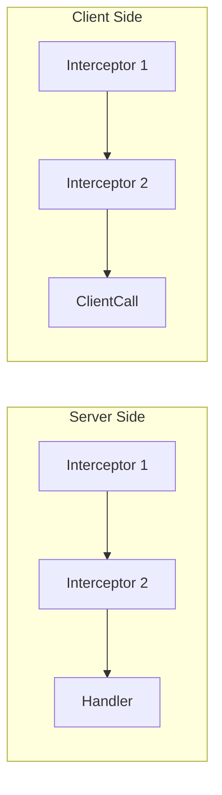

- **ServerInterceptor**: `intercept(MethodDescriptor, Metadata, ServerCall) -> ServerCall`
- **ClientInterceptor**: `intercept(MethodDescriptor, CallOptions, Metadata, ClientCall) -> ClientCall`
- Interceptors can modify metadata, add logging, enforce authentication, etc.

## Metadata System

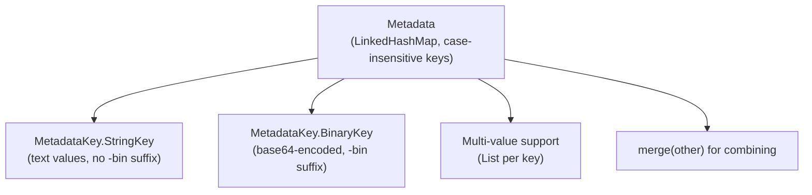

- Keys are normalized to lowercase
- Binary keys (suffix `-bin`) use Base64 encoding/decoding
- `GrpcHeaders.extractMetadata()` filters out gRPC-specific headers

## Thread Safety

- `GrpcServiceRegistry` uses `ConcurrentHashMap` for all handler and descriptor maps
- `GrpcServer.interceptors` uses `CopyOnWriteArrayList` for safe concurrent reads
- `ServerCall` and `ClientCall` are per-request instances (no shared mutable state)
- `ProtoMessage` is mutable but intended for single-threaded use within a call

## Integration with Lego Flow

| Lego Flow Module | Usage in gRPC |
|------------------|---------------|
| `web/http` | `HttpHeaders` from `ssg.legoflow.http.core` used for gRPC header/trailer construction |

The gRPC module is self-contained for protobuf and gRPC framing. Remote gRPC calls use the `web/http2` module for HTTP/2 connection management, HPACK header compression, and frame construction.

---

## Related Documentation

- [Module README](../README.md) | [Requirements](REQUIREMENTS.md) | [Compliance](COMPLIANCE.md)

---

**Last Updated**: 2026-07-07
