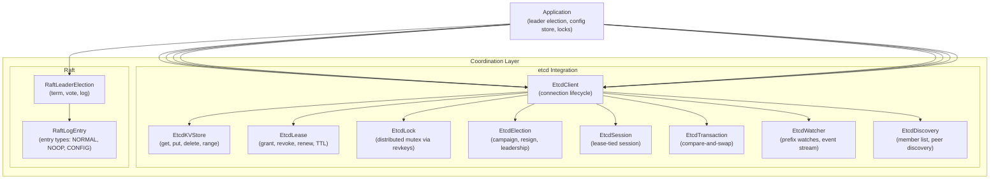

# Cluster Coordination (etcd/Raft) — Architecture

## Module Purpose

The cluster coordination module provides distributed coordination primitives built on etcd and Raft consensus. It enables shared state management, leader election, distributed locking, and key-value storage across cluster nodes — forming the coordination layer for cluster-aware applications.

## Architecture Overview

The module provides two layers of coordination:

1. **etcd Client API** — Full client for etcd's HTTP API (KV store, leases, watches, locks, elections, sessions, transactions)
2. **Raft Leader Election** — Lightweight Raft-style leader election simulation for in-process or in-cluster coordination



## Package Structure

```
ssg.legoflow.service.cluster.coordination/
  EtcdClient           — Connection to etcd cluster (endpoints, leader detection, reconnect)
  EtcdConfig           — Connection configuration (endpoints, dial timeout, auth)
  EtcdKVStore          — Key-value operations (get, put, delete, range scan)
  EtcdLease            — TTL-based lease (grant, revoke, renew, keep-alive)
  EtcdLock             — Distributed mutex (acquire, extend, release via revkeys)
  EtcdElection         — Leader election (campaign, resign, leadership check)
  EtcdSession          — Session bound to a lease (liveness tracking)
  EtcdTransaction      — Compare-and-swap transactions (conditional put)
  EtcdWatcher          — Key prefix watch (event stream with reconnection)
  EtcdDiscovery        — Cluster member discovery via etcd endpoints API
  RaftLeaderElection   — Lightweight Raft leader election (term, vote, log)
  RaftLogEntry         — Raft log entry model (term, index, type, data)
```

## Design Decisions

- **etcd as primary coordination backend** — Provides all standard coordination primitives (KV, leases, locks, watches) backed by Raft consensus.
- **Separate Raft simulation** — `RaftLeaderElection` provides a lightweight, dependency-free leader election for environments without etcd. Useful for demos, testing, and embedded scenarios.
- **Connection lifecycle management** — `EtcdClient` handles endpoint failover, leader detection, and automatic reconnection.
- **Lease-based liveness** — Leases and sessions are the building blocks for distributed coordination; locks and elections are implemented on top of leases.
- **Async API** — All etcd operations return `CompletableFuture` for non-blocking execution.
