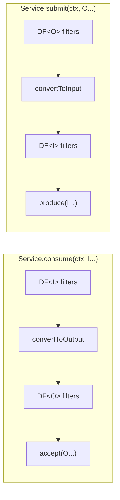
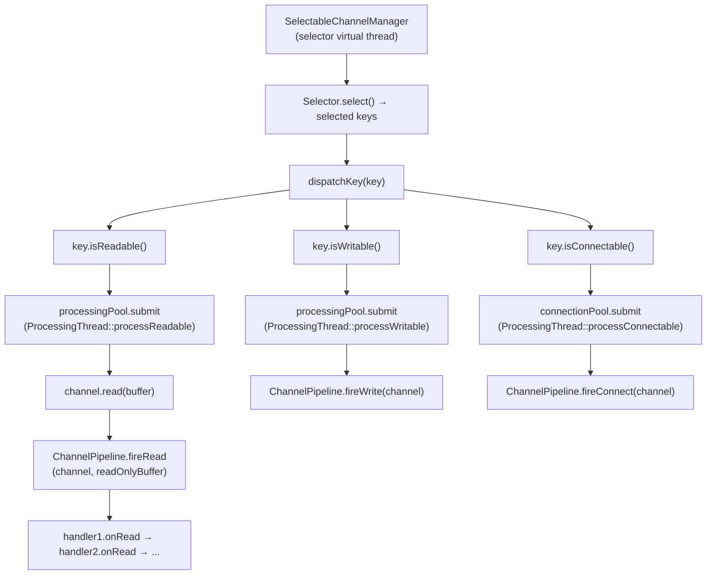
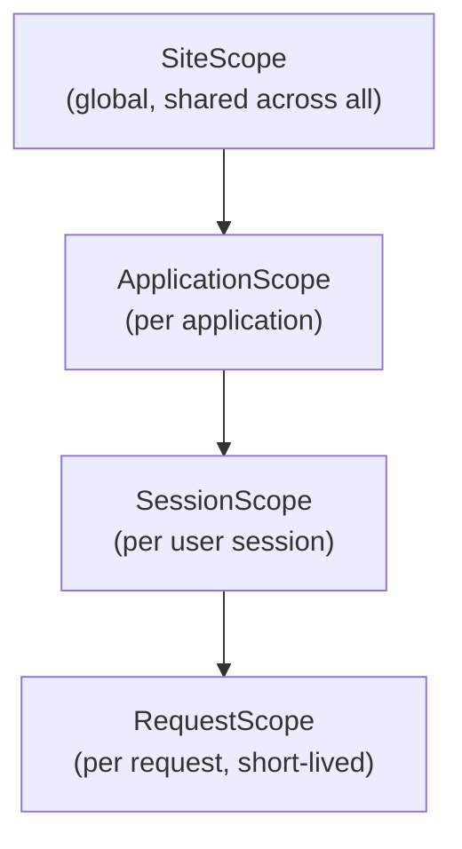
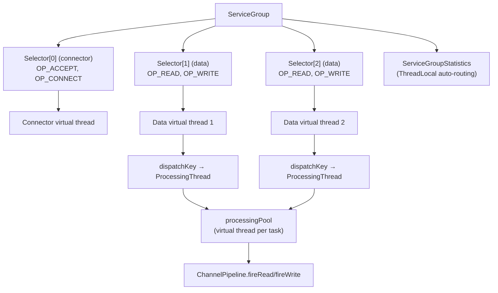
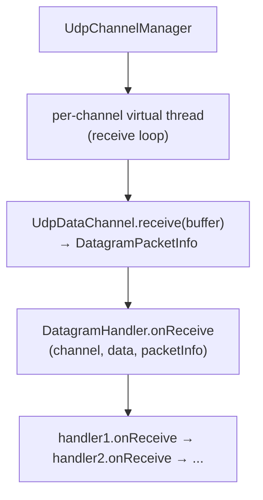

# Service Module — Architecture

## Module Purpose

Extends the blocks module's DataProcessor/DataFilter abstractions into a service-oriented framework with lifecycle management, scoped context propagation, user/role-based access control, dual API support, NIO channel management, and virtual-thread I/O event dispatch.

## Key Abstractions

### ServiceState
Rich enum of 9 service states that maps to `ProcessorState` while providing finer-grained semantics:

| ServiceState | ProcessorState | Description |
|---|---|---|
| IDLE | IDLE | Not yet started |
| CONNECTING_TRANSPORT | CONNECTING | Transport-level handshake in progress |
| AUTHENTICATING | CONNECTING | Authentication in progress |
| READY | READY | Fully operational |
| PAUSED | PAUSED | Temporarily suspended |
| DRAINING | READY | Finishing in-flight work before disconnect |
| DISCONNECTING | READY | Shutdown initiated |
| FAILED | FAILED | Irrecoverable error |
| STOPPED | STOPPED | Terminated (no further transitions) |

Valid transitions are enforced via a static `Map<ServiceState, Set<ServiceState>>`; `canTransitionTo()` is O(1).

### Service<I,O>
Extends `DataProcessor<I,O>` with:
- **ServiceDescriptor** — record with name, description, priority, dependencies
- **Connection lifecycle** — connect(ctx)/disconnect(ctx)/isConnected()
- **Default async()** — returns AsyncService wrapper

### AsyncService<I,O>
Lightweight wrapper pattern:
- Delegates all operations to sync Service on virtual threads
- Uses `CompletableFuture.runAsync(sync::method, virtualThreadExecutor)`
- `sync()` method returns back-reference to original

### ServiceContext
Extends Context with:
- 4-level scope hierarchy: SiteScope → ApplicationScope → SessionScope → RequestScope
- User identity (ServiceUser) with types: ANONYMOUS, SHARED, EXACT
- Role-based permission checking via AccessControl

### DataChannel
NIO-oriented channel interface extending `AutoCloseable`:
- `read(ByteBuffer)` / `write(ByteBuffer)` — raw byte I/O
- `isOpen()` — liveness check
- `getSelectionKey()` — exposes the NIO `SelectionKey` for use with a `Selector`

### ChannelHandler
Event callback interface for I/O lifecycle events on a `DataChannel`:
- `onRead(channel, data)` — called with a read-only view of the received bytes
- `onWrite(channel)` — called when the channel is writable
- `onConnect(channel)` / `onDisconnect(channel)` — connection lifecycle
- `onError(channel, cause)` — exception from any other callback

### ChannelPipeline
Ordered chain of `ChannelHandler` instances backed by `CopyOnWriteArrayList`:
- `addFirst/addLast/remove` — dynamic handler management, safe under concurrent modification
- `fire*` methods propagate events through all handlers in insertion order; if a handler throws, propagation stops and `fireError` is called on **all** handlers (iterates from the beginning, not just the remaining ones)
- `fireRead` passes `data.asReadOnlyBuffer()` to each handler to protect the shared buffer position

## Design Patterns

### Wrapper Pattern (Async) — Deliberate Virtual Thread Strategy

Core implementation is always synchronous. Async variant delegates to sync on virtual threads. No parallel code paths — async is never a separate implementation. Applies at two levels:
- `AsyncService` wraps a single `Service`
- `AsyncServicesManager` wraps a `ServicesManager`; mirrors the same API with `CompletableFuture` returns and a `sync()` back-reference

**Why sync-primary despite async-primary NIO?** The NIO layer (`SelectableChannelManager`) is inherently event-driven and non-blocking — the selector loop dispatches I/O events to virtual thread pools, and `ConnectionThread` already returns `CompletableFuture<Void>`. However, the `DataProcessor<I,O>` API at the blocks level uses synchronous signatures (`void consume(...)`, `void produce(...)`) as a deliberate JDK 25 design choice. Virtual threads eliminate the traditional cost of blocking: a sync method running on a virtual thread is effectively async from the platform scheduler's perspective, with near-zero overhead. This gives us the simplicity of synchronous code (easier to reason about, debug, test, and stack-trace) without the throughput penalty that motivated async frameworks in pre-virtual-thread Java. Inverting the relationship (async-primary with sync wrapping via `.join()`) would require rewriting `DataProcessor` and all 42 module implementations for no measurable runtime benefit — virtual threads already bridge the impedance mismatch at the JVM level.

### Builder Pattern (ServiceBuilder)
Lambda-based service construction:
- `onConvertToOutput(BiFunction)` — I→O conversion
- `onConvertToInput(BiFunction)` — O→I conversion
- `onConnect/onDisconnect(BiConsumer<ServiceContext, Service<I,O>>)` — lifecycle hooks

### Template Method (AbstractService)
Extends AbstractDataProcessor, adds:
- `doConnect(ctx)` / `doDisconnect(ctx)` — overridable hooks
- Automatic state transitions: `IDLE → CONNECTING → READY` on connect, using `ProcessorState` values directly (`transitionTo(ProcessorState.CONNECTING)` then `transitionTo(ProcessorState.READY)`). `AbstractService` does **not** use `ServiceState`'s fine-grained values (`CONNECTING_TRANSPORT`, `AUTHENTICATING`); those are available for custom subclasses that manage their own state via `ServiceState`.

### Composition (ServiceComposer)
Composes multiple services into ordered chains with `connectAll`/`disconnectAll` respecting insertion order.

### Event Loop + Handler Chain (NIO)
`SelectableChannelManager` runs a single virtual-thread selector loop. On each readable/writable/connectable key it submits a `ProcessingThread` task to a separate virtual-thread pool, keeping the selector loop non-blocking. Each `ProcessingThread` fires the appropriate event through the service's `ChannelPipeline`, which walks its handler chain in order.

### Multi-Selector Event Loop (ServiceGroup)
`ServiceGroup` extends the single-selector design to N+1 selectors:
- **Selector[0]** (connector) — handles OP_ACCEPT and OP_CONNECT events
- **Selectors[1..N]** (data) — handle OP_READ and OP_WRITE events
- Round-robin channel assignment distributes load across data selectors
- Each selector runs in its own virtual thread
- `ServiceGroupStatistics` uses ThreadLocal<Integer> for automatic per-selector routing
- Builder pattern: `ServiceGroup.builder("name").dataSelectorCount(2).bufferSize(8192).build()`
- `ChannelRegistration` record associates a `DataChannel` with its `ChannelPipeline` as SelectionKey attachment
- `UdpDataChannel` supports deferred registration (construct without Selector, register later via `registerWith(Selector)`)

#### UDP Dispatch in ServiceGroup
ServiceGroup dispatches UDP readable events differently from TCP. For non-UDP channels, `dispatchKey()` submits a `ProcessingThread` task which calls `channel.read(buffer)` and then `ChannelPipeline.fireRead()`. This does not work for UDP because `ProcessingThread` consumes the datagram via `channel.read()`, and then `DatagramHandler.onRead()` tries `receiveDatagram()` on an already-empty channel.

For `UdpDataChannel`, `dispatchKey()` instead:
1. Calls `receiveDatagram()` directly on the `UdpDataChannel` to get the datagram data and sender address (`DatagramPacketInfo`)
2. Invokes `ChannelPipeline.fireDatagram(channel, packetInfo)` to dispatch the datagram to all `DatagramHandler` instances in the pipeline

`ChannelPipeline.fireDatagram(DataChannel, DatagramPacketInfo)` iterates all handlers, invoking `onReceive()` on each `DatagramHandler` in the chain. This preserves the sender address metadata that would be lost if the datagram were read as raw bytes through the TCP-oriented `fireRead()` path.

### ByteBuffer Stream Contract (DP/DF Pipeline)
The transport layer (`ProcessingThread` + `SelectableChannelManager`) and the codec layer have a clear contract for handling TCP byte streams:

- **Transport does NOT accumulate**: `ProcessingThread.processReadable()` passes a single `read()` worth of data to the pipeline via `ChannelPipeline.fireRead`. It never buffers or coalesces reads across selector wake-ups.
- **Codecs DO accumulate**: Codecs in the pipeline (e.g. `Http2FrameCodec`, `RtspCodec`, `SipCodec`, `LdapCodec`) are stateful stream transformers. Each maintains an internal `ByteBuffer` accumulator, combines incoming chunks with previously buffered partial data, extracts complete protocol units, and saves the remainder.
- **Partial data is normal**: A single `read()` may deliver a fragment of a message, exactly one message, or multiple messages. This is a normal TCP condition, not an error.

This contract is documented in the Javadoc of both `ProcessingThread` (class-level) and `SelectableChannelManager.dispatchKey()`. The pattern originates from `Http2FrameCodec` and has been adopted by `RtspCodec`, `SipCodec`, and `LdapCodec`.

### Decorator / Filter (ContextPropagationFilter)
`ContextPropagationFilter<T>` extends `AbstractDataFilter` and is installed in a service's filter chain. On each `doFilter` call it copies Request- and Session-scope attributes from a source `ServiceContext` into the current context, enabling scope propagation across service boundaries without coupling the services directly.

## Data Flow

### Service data processing (unchanged)

### NIO channel I/O

## Dual API Approach

| Style | Sync (primary) | Async (wrapper) |
|-------|------|-------|
| **Procedural** | `service.consume(ctx, data)` | `asyncService.consume(ctx, data)` → `CompletableFuture<Void>` |
| **Functional** | `ServicePipeline.map().filter().process()` | `AsyncServicePipeline.process()` → `CompletableFuture<List<T>>` |
| **Manager** | `servicesManager.startAll()` | `asyncServicesManager.startAll()` → `CompletableFuture<Void>` |

The sync variant is the core implementation; the async variant is a thin wrapper that submits work to `Executors.newVirtualThreadPerTaskExecutor()`. Callers who need `CompletableFuture` composability (e.g., combining results from multiple services, timeouts, or reactive pipelines) use the async API. Callers who prefer straightforward sequential code use the sync API directly — on virtual threads, this is equally performant.

## Scope Hierarchy

All scopes use ConcurrentHashMap for thread-safe attribute storage. Each scope has independent lifecycle — destroying a child scope does not affect parent.

## Thread Safety Model

- **Scopes**: ConcurrentHashMap for attributes, UUID-based IDs
- **State**: AtomicReference<ProcessorState> (inherited from AbstractDataProcessor)
- **Statistics**: Atomic counters per type (inherited from ProcessorStatistics)
- **Connected flag**: AtomicBoolean in AbstractService
- **ServicesManager**: ConcurrentHashMap<String, Service<?,?>>
- **Async execution**: Virtual thread per task via Executors.newVirtualThreadPerTaskExecutor()
- **SelectableChannelManager**:
  - `channelsByService` / `pipelinesByService` — ConcurrentHashMap, safe for concurrent register/unregister
  - `running` — AtomicBoolean guards event loop start/stop
  - `selectorThread` — volatile reference; joined with 5 s timeout on stopEventLoop
  - Two independent virtual-thread pools: `connectionPool` (connection tasks) and `processingPool` (I/O dispatch)
- **ChannelPipeline**: CopyOnWriteArrayList allows handler add/remove during event dispatch without locking
- **ProcessingThread**: each readiness event gets its own virtual thread; `ByteBuffer` is owned per-instance and not shared
- **ConnectionThread**: volatile Thread reference; `cancel()` uses thread interrupt for cooperative cancellation
- **ServiceGroup**: AtomicBoolean `running`, AtomicInteger `nextSelectorIndex` for round-robin, CopyOnWriteArrayList for registered channels
- **ServiceGroupStatistics**: ThreadLocal<Integer> for per-thread selector index; all counters are AtomicLong or AtomicLongArray; `Snapshot` record is immutable
- **UdpDataChannel**: `selectionKey` is volatile to support deferred registration from a different thread

## Extension Points

- Subclass `AbstractService` for custom services
- Use `ServiceBuilder` for lambda-defined services
- Implement `Scope` for custom scope types
- Extend `AccessControl` for custom permission logic
- Implement `ServicesManager` for custom lifecycle management
- Implement `DataChannel` for custom transport (in-memory, socket, pipe, etc.)
- Implement `ChannelHandler` and add to a service's `ChannelPipeline` for custom I/O processing
- Extend `SelectableChannelManager` to override buffer sizes, selector timeout, or dispatch strategy
- Implement `DatagramHandler` for custom UDP datagram processing
- Extend `UdpDataChannel` or `MulticastDataChannel` for custom UDP transport behavior
- Configure `UdpChannelManager` for custom receive buffer sizes or handler chains
- Install `ContextPropagationFilter` in a service filter chain to propagate ServiceContext scopes across service boundaries

## Package Map

| Package | Contents |
|---|---|
| `service` | Service, AsyncService, ServiceState, ServiceContext |
| `service.user` | ServiceUser, AccessControl |
| `service.scope` | SiteScope, ApplicationScope, SessionScope, RequestScope |
| `service.manager` | ServicesManager, AbstractServicesManager, SelectableChannelManager, AsyncServicesManager, ConnectionThread, ProcessingThread, ServiceGroup, ServiceGroupStatistics |
| `service.channel` | DataChannel, ChannelHandler, ChannelPipeline |
| `service.channel.udp` | UdpDataChannel, DatagramHandler, MulticastDataChannel, MulticastConfig, DatagramPacketInfo, UdpChannelManager |
| `service.filter` | ContextPropagationFilter |
| `service.functional` | ServicePipeline, AsyncServicePipeline, ServiceBuilder, ServiceComposer |
| `service.demo.*` | Procedural, functional, and combined demos |

## UDP Transport

The service module provides UDP-based communication alongside the existing TCP/NIO channel infrastructure.

### UdpDataChannel

Implements `DataChannel` for UDP datagrams, wrapping a `java.nio.channels.DatagramChannel`. Provides `send(ByteBuffer, SocketAddress)` and `receive(ByteBuffer)` in addition to the standard `read`/`write` from `DataChannel`. Unlike TCP channels, each read/write operates on a complete datagram rather than a byte stream.

### DatagramHandler

Event callback interface for datagram I/O events, analogous to `ChannelHandler` for TCP:
- `onReceive(channel, data, packetInfo)` — called when a datagram is received, with metadata about source address
- `onSend(channel, packetInfo)` — called after a datagram is sent
- `onError(channel, cause)` — called on I/O errors

### MulticastDataChannel

Extends `UdpDataChannel` with multicast group management:
- `joinGroup(InetAddress group)` / `leaveGroup(InetAddress group)` — multicast membership
- Configurable via `MulticastConfig` (group address, network interface, TTL)
- Supports multiple simultaneous group memberships

### MulticastConfig

Configuration record for multicast settings:
- Group address (multicast IP)
- Network interface selection
- Time-to-live (TTL) for outgoing datagrams
- Loopback disable option

### DatagramPacketInfo

Metadata record carrying source and destination address/port for each datagram. Passed to `DatagramHandler.onReceive` to identify the sender without parsing the datagram payload.

### UdpChannelManager

Manages UDP channels with virtual-thread receive loops:
- One virtual thread per registered `UdpDataChannel` running a receive loop
- Dispatches received datagrams to registered `DatagramHandler` instances
- Analogous to `SelectableChannelManager` for TCP, but uses blocking receive on virtual threads instead of NIO Selector (UDP does not benefit from selector-based multiplexing in the same way as TCP)

### ServiceGroup Multi-Selector I/O

### UDP Data Flow

## Dependencies

- `blocks` — DataProcessor, DataFilter, Context, ProcessorState, ProcessorStatistics
- `slf4j-api` — Logging
- JDK NIO — `java.nio.channels.{Selector, SelectionKey, SelectableChannel, DatagramChannel}` (no external NIO library)

## Related Documentation

- [Module README](../README.md) | [Requirements](REQUIREMENTS.md)
- [Root Architecture](../../doc/ARCHITECTURE.md) | [Root README](../../README.md)
