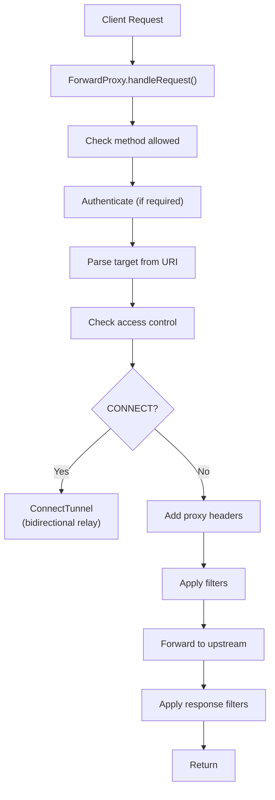
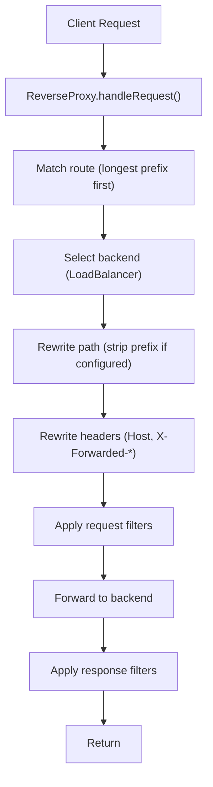
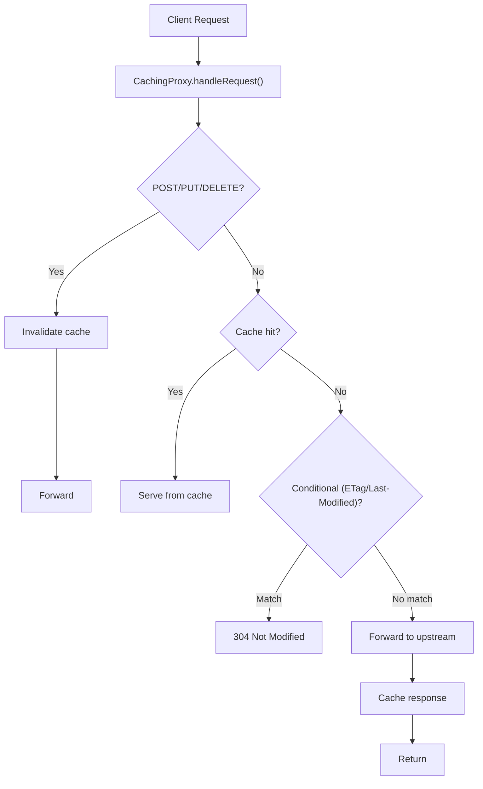

# HTTP Proxy Module -- Architecture

## Module Purpose

Provides pluggable HTTP forward and reverse proxy functionality that integrates with the existing `http` module's server/client infrastructure.

## Key Abstractions

### Forward Proxy Layer
- `ForwardProxy` receives client requests, parses target from URI or Host header, applies access control, adds proxy headers, and forwards to upstream using `java.net.http.HttpClient`
- Default `simulateUpstreamRequest()` opens real TCP connections via JDK `HttpClient`, maps request/response headers, and handles errors (502 for connection failures, 504 for timeouts)
- Hop-by-hop headers (`connection`, `transfer-encoding`, etc.) are stripped in both directions via `RESTRICTED_HEADERS` and `RESPONSE_HOP_BY_HOP` constant sets
- `ConnectTunnel` handles HTTPS tunneling: two virtual threads relay bytes bidirectionally between client and upstream server
- `ProxyAccessControl` interface allows pluggable host-based allow/deny rules

### Reverse Proxy Layer
- `ReverseProxy` matches incoming paths to `ProxyRoute` definitions (longest-prefix-first), selects a `BackendServer` via `LoadBalancer`, rewrites headers, and forwards
- `LoadBalancer` interface with `RoundRobinBalancer` (weighted) and `LeastConnectionsBalancer` implementations
- `HealthChecker` runs periodic checks against backends using a `ScheduledExecutorService`

### Caching Layer
- `CachingProxy` wraps `ReverseProxy` as a decorator, intercepting cacheable GET/HEAD requests
- `ProxyCacheStore` interface with `InMemoryProxyCacheStore` (LRU, read-write locked) implementation
- Respects Cache-Control, ETag, Last-Modified; invalidates on POST/PUT/DELETE

### Integration Layer
- `ProxyHandler` implements `HttpRequestHandler` for use with `HttpRouter`
- `ProxyFilter` interface for request/response modification in the proxy pipeline
- `ProxyHeaders` utility for standard proxy header manipulation (XFF, Via, X-Real-IP)
- `ProxyErrorHandler` produces 502/504/503 responses

## Design Patterns

| Pattern | Usage |
|---------|-------|
| Strategy | `LoadBalancer` for backend selection, `ProxyAccessControl` for access rules |
| Decorator | `CachingProxy` wraps `ReverseProxy` |
| Observer | `HealthChecker` monitors `BackendServer` health |
| Chain of Responsibility | `ProxyFilter` chain for request/response modification |
| Adapter | `ProxyHandler` adapts proxy to `HttpRequestHandler` |

## Data Flow

### Forward Proxy

### Reverse Proxy

### Caching Proxy

## Thread Safety

- `BackendServer` uses `AtomicBoolean`, `AtomicInteger`, `AtomicLong` for thread-safe counters
- `InMemoryProxyCacheStore` uses `ReentrantReadWriteLock` for concurrent access
- `HealthChecker` uses `ScheduledExecutorService` with daemon threads
- `ConnectTunnel` uses virtual threads for relay, `AtomicBoolean` for active state
- Route and filter lists use `CopyOnWriteArrayList`

## Extension Points

- `LoadBalancer` -- custom load balancing strategies
- `ProxyCacheStore` -- custom cache storage (Redis, disk, etc.)
- `ProxyAccessControl` -- custom access control rules
- `ProxyFilter` -- request/response modification
- `ProxyAuthenticator` -- custom authentication schemes
- `ForwardProxy.simulateUpstreamRequest()` -- override for custom upstream communication (default uses `java.net.http.HttpClient`)
- `ReverseProxy.setRequestForwarder()` -- custom backend communication

## Related Documentation

- [Module README](../README.md) | [Requirements](REQUIREMENTS.md) | [Compliance](COMPLIANCE.md)
- [Root Architecture](../../doc/ARCHITECTURE.md) | [Root README](../../README.md)
