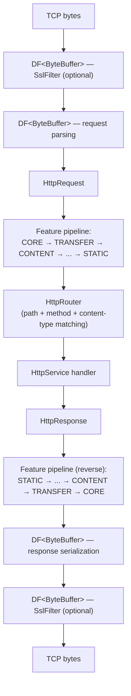
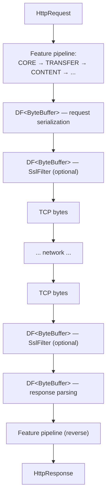

# HTTP Module — Architecture

## Module Purpose

The http module provides a complete HTTP/1.1 implementation (RFC 2616) for the Lego Flow framework. It builds on the blocks DP/DF model and the service lifecycle framework to deliver a feature-pluggable HTTP server and client with SSL/TLS, WebSocket upgrade, static content, caching, and content negotiation.

## Feature System Architecture

### HttpFeature

A pluggable unit of HTTP functionality. Each feature implements request/response processing hooks and belongs to exactly one category.

### HttpFeatureCategory

Enumeration of feature categories: CORE, TRANSFER, CONTENT, CACHING, CONNECTION, ENTITY, METADATA, SECURITY, WEBSOCKET, STATIC. Categories provide logical grouping and enable selective composition.

### HttpFeatureSet

Immutable, ordered collection of features assembled for a specific configuration. Features execute in category order during request/response processing. Created via builder or standard profile constants.

### HttpFeatureRegistry

Central registry of available features. Resolves feature categories to concrete implementations, enabling custom feature substitution.

## Package Structure

```
ssg.legoflow.http/
  core/            — HttpRequest, HttpResponse, HttpMethod, HttpStatus, HttpVersion, HttpHeaders, HttpContext, HttpService, HttpProtocolCodec, HttpRequestHandler, HttpConstants
  header/          — MediaType, ContentEncoding, EntityTag, QualityValue, TransferEncoding, RangeUnit, LanguageTag, ProductToken
  transfer/        — ChunkedCodec, ContentEncodingCodec, FixedLengthCodec, ByteRangeHandler
  content/         — ContentNegotiator, ContentTypeResolver, MediaTypeRegistry
  caching/         — CacheControl, CachePolicy, CacheValidator, ResponseCache, InMemoryResponseCache
  connection/      — ConnectionManager, ConnectionConfig, UpgradeHandler
  websocket/       — WebSocketUpgradeFeature, WebSocket handshake
  security/        — SslFilter, SslConfig, SslHandshakeHandler, HstsPolicy, SecurityExtension, AppSecurityExtension
  staticcontent/   — ContentResolver, ClasspathContentResolver, DirectoryContentResolver, StaticContentHandler, StaticContentConfig
  feature/         — HttpFeature, HttpFeatureCategory, HttpFeatureSet, HttpFeatureRegistry
  config/          — HttpServerConfig, HttpClientConfig
  server/          — HttpServer, HttpRouter, request dispatching
  client/          — HttpClient, request sending, response handling
  demo/
    server/        — server demos: MinimalServer, StaticFileServer, UserManagementServer, SecureServer, WebSocketServer, CachingServer, FullFeaturedServer
    client/        — client demos: MinimalClient, AdaptiveClient, RangeClient, SecureClient, WebSocketClient
    multi/         — multi-component demos: MultiServerDemo, ClientServerPairDemo, LoadBalancedDemo
```

## Data Flow — HTTP Request Lifecycle

### Server-Side Request Processing



### Client-Side Request Processing



## SSL as DataFilter Pattern

SSL/TLS is implemented as `SslFilter extends AbstractDataFilter<ByteBuffer>`, positioned at the remote byte boundary in the DP filter chain. This design:

- Reuses the blocks framework's filter composition — SSL is just another filter
- Allows stacking with other byte-level filters (compression, logging)
- Keeps the HTTP layer unaware of encryption — features process plaintext messages
- Enables optional SSL — omit the filter for plain HTTP

## Standard Profiles Design

Profiles are predefined `HttpFeatureSet` constants that bundle feature categories for common use cases:

```
SERVER_MINIMAL   = [CORE, TRANSFER, CONNECTION]
SERVER_STANDARD  = [CORE, TRANSFER, CONTENT, CACHING, CONNECTION, ENTITY, METADATA]
SERVER_FULL      = [CORE, TRANSFER, CONTENT, CACHING, CONNECTION, ENTITY,
                    METADATA, SECURITY, WEBSOCKET, STATIC]

CLIENT_MINIMAL   = [CORE, TRANSFER]
CLIENT_STANDARD  = [CORE, TRANSFER, CONTENT, CONNECTION, ENTITY, METADATA]
CLIENT_FULL      = [CORE, TRANSFER, CONTENT, CONNECTION, ENTITY,
                    METADATA, SECURITY, WEBSOCKET]
```

Profiles can be extended via the builder: start from a profile and add/remove categories.

## Content Negotiation with Q-Factor

Content negotiation follows RFC 2616 Section 12:

1. Parse Accept, Accept-Charset, Accept-Encoding, Accept-Language headers
2. Extract q-factor weights (0.0 to 1.0, default 1.0)
3. Match available representations against client preferences
4. Select best match by highest q-factor, with specificity as tiebreaker
5. Return 406 Not Acceptable if no match found

## Caching Strategy

### ETag-Based

- Server generates ETag from content hash or version
- Client sends `If-None-Match: <etag>` on subsequent requests
- Server responds 304 Not Modified if ETag matches

### Time-Based

- Server sends `Last-Modified` header
- Client sends `If-Modified-Since: <date>` on subsequent requests
- Server responds 304 Not Modified if resource unchanged

### Cache-Control

- `Cache-Control` header directives: max-age, no-cache, no-store, must-revalidate
- Applied by the CACHING feature category in the pipeline

## Default Gzip Compression

`HttpServer` has `compressionEnabled = true` by default. When a client sends `Accept-Encoding: gzip` in the request, the server automatically applies gzip encoding to the response body via `ContentEncodingCodec` in the TRANSFER feature category. No explicit configuration is required — compression is transparent to `HttpService` handlers and is disabled only when the client omits `Accept-Encoding: gzip` or when `compressionEnabled` is set to `false` in `HttpServerConfig`.

## Extension Points

### SecurityExtension

Interface for custom security processing beyond SSL/TLS. Invoked by the SECURITY feature during request handling. Implementations can perform authentication, authorization, and security header injection.

### AppSecurityExtension

Application-level security extension for custom business logic. Allows application-specific security rules (API keys, tokens, rate limiting) to integrate with the HTTP feature pipeline.

### Custom Features

New `HttpFeature` implementations can be registered with `HttpFeatureRegistry` to extend or replace standard behavior within any category.

## Demo Architecture

Demos are organized into three sub-packages under `demo/` reflecting progressive complexity:

| Sub-package | Demos | Purpose |
|---|---|---|
| `demo/server/` | MinimalServer, StaticFileServer, UserManagementServer, SecureServer, WebSocketServer, CachingServer, FullFeaturedServer | Server-side feature combinations from bare-bones to all categories |
| `demo/client/` | MinimalClient, AdaptiveClient, RangeClient, SecureClient, WebSocketClient | Client-side feature patterns including adaptive profile switching |
| `demo/multi/` | MultiServerDemo, ClientServerPairDemo, LoadBalancedDemo | Multi-component scenarios: dual servers, matched pairs, load balancing |

**AdaptiveClient** is architecturally notable: it demonstrates runtime feature set switching (MINIMAL → STANDARD → FULL) driven by server capability signals, exercising the `HttpFeatureSet` builder's incremental composition. This is a first-class usage pattern — feature sets are immutable, so adaptation creates a new `HttpFeatureSet` from the current one via `.toBuilder()`.

**LoadBalancedDemo** composes multiple `HttpServer` instances behind a routing layer implemented at demo level (no dedicated `LoadBalancer` infrastructure class). This validates that the builder/router API supports multi-server deployment scenarios with the existing abstractions.

## Stream-Oriented Codec Design

### Problem

TCP delivers an arbitrary byte stream, not message-aligned buffers. A single `read()` may return half a chunk, two and a half WebSocket frames, or an HTTP header split across multiple reads. Codecs that assume complete protocol units in each input buffer will either throw exceptions or silently corrupt data when faced with partial reads.

### Pattern: Internal Accumulator

All ByteBuffer-based codecs in the HTTP module follow the same accumulator pattern (originally established by `Http2FrameCodec` in the http2 module):

```
┌─────────────────────────────────────────────┐
│  Codec (ChunkedCodec / WebSocketFrameCodec  │
│         / HttpProtocolCodec)                 │
│                                              │
│  ByteBuffer accumulator                      │
│  ┌────────────────────────────┐              │
│  │ leftover from previous call│              │
│  └────────────────────────────┘              │
│           │                                  │
│           ▼                                  │
│  combineWithAccumulator(newInput)            │
│  ┌────────────────────────────────────┐      │
│  │ accumulator bytes + new bytes      │      │
│  └────────────────────────────────────┘      │
│           │                                  │
│           ▼                                  │
│  Parse complete protocol units               │
│  (chunks / frames / HTTP messages)           │
│           │                                  │
│           ▼                                  │
│  Save remainder back into accumulator        │
│  Return parsed units (or null if incomplete) │
└─────────────────────────────────────────────┘
```

Each codec provides three accumulator-related members:

| Member | Purpose |
|--------|---------|
| `ByteBuffer accumulator` | Holds unconsumed bytes between calls |
| `combineWithAccumulator(ByteBuffer)` | Merges accumulator with new input into a single buffer |
| `hasBufferedData()` | Returns `true` if the accumulator contains unconsumed bytes |

### Codecs Using This Pattern

| Codec | Protocol Unit | Streaming Entry Point |
|-------|---------------|----------------------|
| `ChunkedCodec` | Individual transfer-encoding chunks | `decodeChunks()` (rewritten for streaming) |
| `WebSocketFrameCodec` | WebSocket frames | `decodeFrames(ByteBuffer...)` (new) |
| `HttpProtocolCodec` | Complete HTTP request/response | `parseRequestStreaming(ByteBuffer)` / `parseResponseStreaming(ByteBuffer)` (new) |
| `Http2FrameCodec` (http2 module) | HTTP/2 frames | Original reference implementation |

### Null-Return Convention

Streaming parse methods return `null` when insufficient data is available to assemble a complete protocol unit. This allows a simple caller loop:

1. Read bytes from socket into a `ByteBuffer`
2. Call the codec's streaming parse method
3. If result is non-null, process the parsed unit
4. Repeat

No exceptions are thrown for incomplete data. `WebSocketFrameCodec.decodeFrame()` previously threw `ArrayIndexOutOfBoundsException` on partial frames; it now returns `null`.

### Backward Compatibility

Existing non-streaming methods (`parseRequest()`, `parseResponse()`, `decodeFrame()`, `decodeChunks()`) retain their original signatures and behavior. The streaming methods are additions that use the internal accumulator; the original methods continue to work for callers that provide complete input buffers.

---

## Related Documentation

- [Module README](../README.md) | [Requirements](REQUIREMENTS.md) | [Compliance](COMPLIANCE.md)
- [Root Architecture](../../doc/ARCHITECTURE.md) | [Root README](../../README.md)

---

**Last Updated**: 2026-07-06
