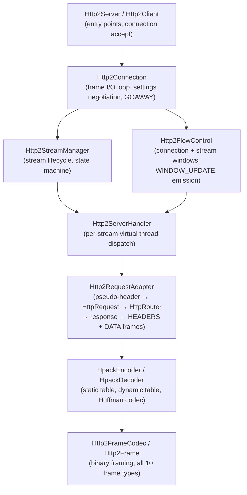
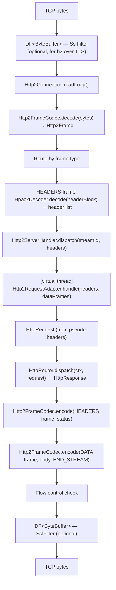
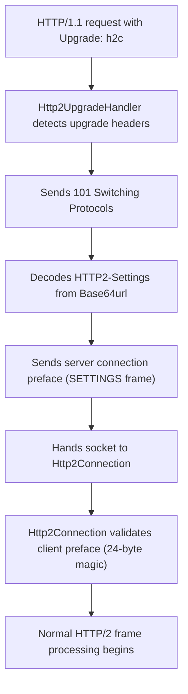

# HTTP/2 Module — Architecture

## Module Purpose

The http2 module provides a complete HTTP/2 implementation (RFC 7540 / RFC 9113) for the Lego Flow framework. It builds on the blocks DP/DF model and the service lifecycle framework, and extends the http module's feature system. Its central goal is transparent HTTP/2 support: existing `HttpRouter` handlers and `HttpResponse` builders require no modification.

## Layer Overview

## Key Abstractions

### Http2Frame / Http2FrameCodec

`Http2Frame` is an immutable value type carrying: length (24-bit), type (`Http2FrameType`), flags (`Http2Flags`), stream identifier (31-bit), and payload bytes. `Http2FrameCodec` reads frames from a `ByteBuffer` and writes them back. The codec has no transport dependency and is tested in isolation.

`Http2FrameType` enumerates the 10 frame types. `Http2ErrorCode` enumerates all RFC 7540 §7 error codes. `Http2Flags` provides named flag accessors (END_STREAM, END_HEADERS, PADDED, PRIORITY, ACK).

### HpackEncoder / HpackDecoder

Implements RFC 7541 header compression. Shared singleton `HpackStaticTable` (61 entries). Per-connection `HpackDynamicTable` maintains a FIFO with byte-size accounting; on overflow, entries are evicted from the oldest end. `HpackHuffman` encodes and decodes using the RFC 7541 Appendix C code table (257 symbols). The encoder uses indexed representation for static-table hits, literal-with-incremental-indexing for new headers, and never-indexed for sensitive headers (e.g., Authorization, Cookie).

### Http2Stream / Http2StreamState / Http2StreamManager

`Http2Stream` holds stream state, flow control windows, and a reference to its processing virtual thread. `Http2StreamState` is a sealed interface with implementations for each RFC 7540 §5.1 state. Transitions are validated; illegal transitions throw `Http2StreamException` (maps to RST_STREAM with PROTOCOL_ERROR).

`Http2StreamManager` owns all streams for a connection. It enforces:
- SETTINGS_MAX_CONCURRENT_STREAMS (default 100)
- Odd stream IDs for client-initiated streams, even for server push
- Monotonically increasing stream IDs

### Http2FlowControl

Tracks two windows per connection: connection-level (shared across all streams) and per-stream. Both start at SETTINGS_INITIAL_WINDOW_SIZE (default 65535). When a DATA frame is consumed, the corresponding window decrements; when bytes cross 50% consumed, a WINDOW_UPDATE frame is scheduled. SETTINGS frames may update initial window size, which adjusts all open streams.

### Http2Connection

Owns the read loop for a single TCP connection. On each iteration it reads one frame, routes it by type:

- SETTINGS → update local settings, send SETTINGS ACK
- HEADERS / CONTINUATION → accumulate header block, decode via HPACK, dispatch stream
- DATA → deliver to stream, trigger flow control
- WINDOW_UPDATE → update sender's window, unblock pending DATA sends
- PING → send PONG
- GOAWAY → initiate graceful shutdown
- RST_STREAM → terminate named stream

All frame sends are serialized through a single lock to prevent interleaving.

### Http2ServerHandler / Http2RequestAdapter

`Http2ServerHandler` receives a decoded header list from the connection, spawns a virtual thread, and delegates to `Http2RequestAdapter`. The adapter:

1. Extracts pseudo-headers (`:method`, `:path`, `:authority`, `:scheme`)
2. Constructs a standard `HttpRequest`
3. Calls `HttpRouter.dispatch(ctx, request)`
4. Encodes the `HttpResponse` status as a HEADERS frame (`:status` pseudo-header)
5. Streams the response body as DATA frames with END_STREAM on the last one

### Http2Feature / Http2UpgradeHandler

`Http2Feature` implements `HttpFeature` with category `HttpFeatureCategory.HTTP2`. When present in a feature set it installs `Http2UpgradeHandler` into the HTTP/1.1 pipeline. The upgrade handler inspects incoming requests for `Connection: Upgrade`, `Upgrade: h2c`, and `HTTP2-Settings` headers. On match it performs the RFC 7540 §3.2 upgrade sequence, then transfers the connection to a new `Http2Connection`.

## Data Flow — HTTP/2 Request Lifecycle

### Server-Side (TLS)

### H2c Upgrade Flow

## Thread Safety Model

- **Frame read loop**: single thread per connection (the connection's virtual thread)
- **Frame write path**: all frame writes go through a per-connection `ReentrantLock`; streams enqueue frames and the lock serializes them
- **Stream processing**: each stream runs on its own virtual thread from a virtual-thread executor
- **Dynamic table**: `HpackDynamicTable` is not shared between connections; per-connection, all access is from the single read-loop thread
- **Flow control counters**: `Http2FlowControl` uses `AtomicLong` for window values, allowing lock-free updates from stream threads while the read loop processes WINDOW_UPDATE frames

## Extension Points

- **Custom push policy**: implement `Http2PushPolicy` and supply it to `Http2Server.builder()`
- **Custom frame handler**: `Http2Connection` supports registering extension frame handlers for frame types outside the standard 10
- **Profile customization**: `Http2Config` wraps `Http2Settings`; any settings parameter can be overridden without touching profiles
- **Feature composition**: add `HttpFeatureCategory.HTTP2` to any `HttpFeatureSet` to enable HTTP/2 upgrade on an existing HTTP/1.1 server

## Related Documentation

- [Module README](../README.md) | [Requirements](REQUIREMENTS.md) | [Compliance](COMPLIANCE.md)
- [Root Architecture](../../doc/ARCHITECTURE.md) | [Root README](../../README.md)
