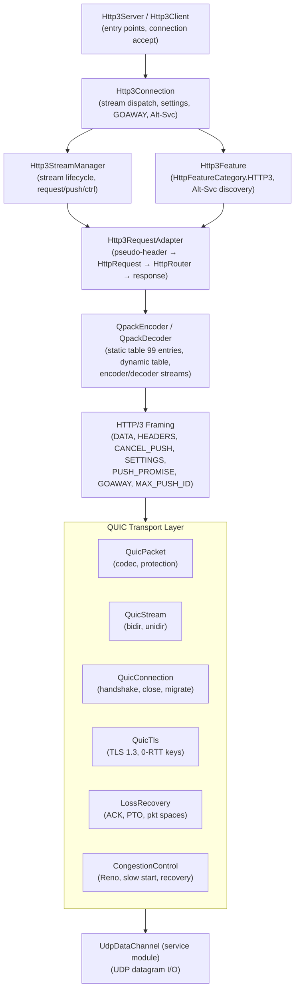
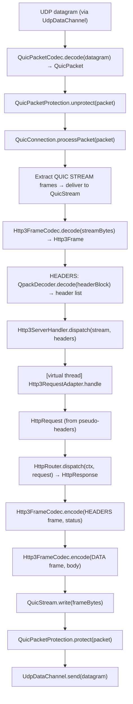
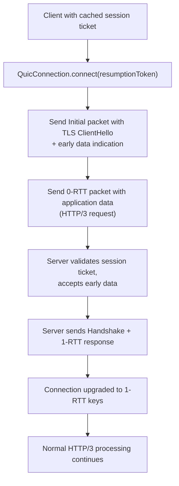
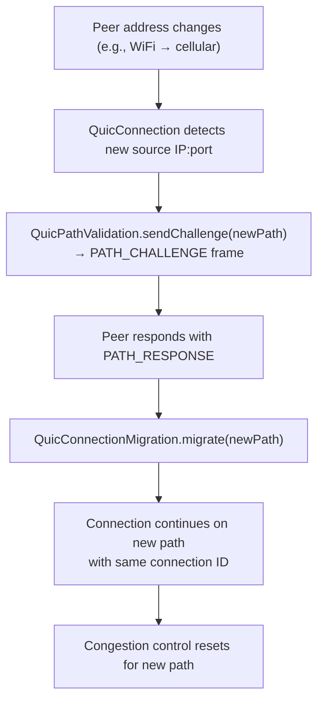

# HTTP/3 Module — Architecture

## Module Purpose

The http3 module provides a complete HTTP/3 implementation (RFC 9114) for the Lego Flow framework, built on QUIC transport (RFC 9000) with QPACK header compression (RFC 9204). It extends the http module's feature system via `HttpFeatureCategory.HTTP3`. Its central goal is transparent HTTP/3 support: existing `HttpRouter` handlers and `HttpResponse` builders require no modification.

## Why a Separate Module

HTTP/3 is architecturally distinct from HTTP/1.1 and HTTP/2 because it runs over QUIC (UDP) rather than TCP:

| Concern | HTTP/1.1 + HTTP/2 (TCP) | HTTP/3 (QUIC/UDP) |
|---|---|---|
| Transport | TCP byte stream | UDP datagrams |
| Connection setup | TCP + TLS handshake (2-3 RTT) | Integrated TLS 1.3 (1 RTT, 0-RTT on resumption) |
| Multiplexing | Application-layer (HTTP/2 streams share TCP) | Transport-layer (QUIC streams are independent) |
| Head-of-line blocking | TCP packet loss blocks all streams | Only the affected stream is blocked |
| Loss recovery | TCP (kernel) | QUIC (application-layer, per packet number space) |
| Congestion control | TCP (kernel) | QUIC (application-layer, pluggable algorithm) |
| Connection identity | IP:port tuple | Connection IDs (survives network changes) |
| Header compression | HPACK (in-band, head-of-line blocking) | QPACK (out-of-band encoder/decoder streams) |

These differences mean that QUIC requires its own connection lifecycle, packet codec, loss recovery, congestion control, and migration logic — none of which exist in the TCP-based http or http2 modules. A separate module keeps these concerns cleanly isolated.

The same separation pattern was used for http2 (separate from http) for similar reasons: HTTP/2's binary framing layer is fundamentally different from HTTP/1.1's text-based protocol, warranting its own module.

## Layer Overview

## Key Abstractions

### QUIC Transport Layer (RFC 9000)

#### QuicPacket / QuicPacketCodec

QUIC defines multiple packet types for different handshake phases:
- **Initial** — first packet, carries TLS ClientHello, uses Initial keys
- **Handshake** — carries TLS handshake messages, uses Handshake keys
- **0-RTT** — early data on resumption, uses 0-RTT keys
- **1-RTT** — application data after handshake, uses Application keys (short header)
- **Retry** — server-issued token for address validation
- **Version Negotiation** — server offers supported QUIC versions

`QuicPacketCodec` handles variable-length connection IDs, packet number encoding (1-4 bytes), and dispatches to `QuicPacketProtection` for encryption/decryption.

#### QuicConnection

Owns the lifecycle of a single QUIC connection:
- TLS 1.3 handshake via `SSLEngine` with `HandshakePhase` tracking (INITIAL, HANDSHAKE, ESTABLISHED, CLOSED)
- ALPN negotiation ("h3"), cipher suite, protocol version, and peer certificate storage
- Stream creation and management
- Packet send/receive via `UdpDataChannel`
- GOAWAY for graceful shutdown
- Connection close with error codes (also closes TLS engine and transitions to CLOSED phase)

The `HandshakePhase` enum maps directly to QUIC encryption levels:
- **INITIAL** — connection created, no handshake started
- **HANDSHAKE** — TLS handshake in progress (SSLEngine driving NEED_WRAP/NEED_UNWRAP/NEED_TASK)
- **ESTABLISHED** — handshake complete, ALPN/cipher/protocol negotiated, application data flows
- **CLOSED** — connection closed, TLS engine shut down

In simulated mode (no real UDP peer), the handshake completes via `completeSimulatedHandshake()` which sets default negotiated values (ALPN="h3", cipher="TLS_AES_128_GCM_SHA256", protocol="TLSv1.3").

#### QuicStream

Individual QUIC stream (bidirectional or unidirectional). Provides ordered, reliable byte delivery within the stream. Streams are independent at the transport level — loss on one stream does not block others.

#### QuicTls / QuicPacketProtection

TLS 1.3 integration specific to QUIC: Initial keys derived from connection ID, handshake keys from TLS key schedule, application keys from TLS exporter. `QuicPacketProtection` applies header protection (XOR mask on packet number bytes) and AEAD encryption (AES-128-GCM or ChaCha20-Poly1305) to payload.

#### QuicLossRecovery

Tracks sent packets per packet number space (Initial, Handshake, Application). Loss detection uses:
- ACK ranges — packets not acknowledged within a threshold are declared lost
- Probe Timeout (PTO) — if no ACK received within estimated RTT + margin, send probe packets
- `QuicRttEstimator` maintains smoothed RTT, RTT variance, and minimum RTT

#### QuicCongestionControl

Reno-like congestion control:
- **Slow start** — exponential window growth until first loss
- **Congestion avoidance** — linear window growth after loss
- **Recovery** — window halved on loss, fast recovery on ACK

#### QuicConnectionMigration / QuicPathValidation

Connection migration detects when the peer's IP:port changes (e.g., WiFi to cellular). The endpoint sends PATH_CHALLENGE on the new path; the peer responds with PATH_RESPONSE. Once validated, the connection migrates to the new path. Connection IDs ensure the connection identity survives address changes.

### QPACK Header Compression (RFC 9204)

#### QpackEncoder / QpackDecoder

QPACK avoids HPACK's head-of-line blocking by separating dynamic table updates from header blocks:
- **Encoder stream** (unidirectional, encoder → decoder) — carries table insert, duplicate, and set-capacity instructions
- **Decoder stream** (unidirectional, decoder → encoder) — carries insert count increment and header acknowledgment
- **Header blocks** on request streams reference the dynamic table by index; the decoder blocks only if a referenced entry has not yet arrived on the encoder stream

#### QpackStaticTable

99 entries (larger than HPACK's 61), covering common HTTP/3 pseudo-headers and header fields per RFC 9204 Appendix A.

#### QpackDynamicTable

Per-connection table with insertion via encoder stream. Entries are indexed by absolute insertion count. The table supports configurable maximum capacity (controlled by SETTINGS_QPACK_MAX_TABLE_CAPACITY).

**Indexing modes:**
- **Relative index** — 0 = newest entry, increases toward older entries (used in header blocks)
- **Absolute index** — monotonically increasing since table creation, equals `insertCount + droppedCount` (used for Required Insert Count)
- **Post-base index** — references entries added after the base, used for entries inserted during the current header block

**Encoder instructions** (sent on encoder stream, processed by decoder):
- `Insert With Static Name Reference` — copy name from static table, provide value
- `Insert With Dynamic Name Reference` — copy name from dynamic table, provide value
- `Insert With Literal Name` — both name and value as literals
- `Set Dynamic Table Capacity` — resize the table
- `Duplicate` — duplicate an existing dynamic entry

**Decoder instructions** (sent on decoder stream, processed by encoder):
- `Section Acknowledgment` — acknowledge processing of a header block for a stream
- `Stream Cancellation` — cancel all references for a stream
- `Insert Count Increment` — increment Known Received Count

**Required Insert Count and Known Received Count** enable the decoder to determine whether all referenced dynamic table entries have been received before attempting to decode a header block.

### HTTP/3 Framing (RFC 9114)

#### Http3Frame / Http3FrameCodec

HTTP/3 frames are simpler than HTTP/2 frames (no flags byte, variable-length type and length fields):
- **DATA** — request/response body
- **HEADERS** — QPACK-encoded header block
- **CANCEL_PUSH** — cancel a server push
- **SETTINGS** — connection-level settings (different parameters than HTTP/2)
- **PUSH_PROMISE** — server push (on request stream, not a separate frame type like HTTP/2)
- **GOAWAY** — graceful shutdown with last stream ID
- **MAX_PUSH_ID** — maximum push ID the client will accept

### Feature Integration

#### Http3Feature

Implements `HttpFeature` with category `HttpFeatureCategory.HTTP3`. When present in a feature set, it registers `AltSvcHandler` which injects `Alt-Svc: h3=":port"` headers into HTTP/1.1 and HTTP/2 responses to advertise HTTP/3 availability.

#### Http3RequestAdapter

Same bridge pattern as http2:
1. Extracts pseudo-headers (`:method`, `:path`, `:authority`, `:scheme`)
2. Constructs a standard `HttpRequest`
3. Calls `HttpRouter.dispatch(ctx, request)`
4. Encodes the `HttpResponse` as HEADERS + DATA frames on the QUIC stream

## Data Flow — HTTP/3 Request Lifecycle

### Server-Side

### 0-RTT Flow

### Connection Migration Flow

## Comparison with HTTP/2 Module

| Aspect | http2 | http3 |
|---|---|---|
| Transport | TCP (via NIO SelectableChannel) | QUIC over UDP (via UdpDataChannel) |
| Header compression | HPACK (RFC 7541, 61 static entries) | QPACK (RFC 9204, 99 static entries) |
| Multiplexing | HTTP/2 streams over single TCP | QUIC streams (transport-level independence) |
| Head-of-line blocking | TCP loss blocks all streams | Only affected QUIC stream blocked |
| Connection setup | TCP + TLS (2+ RTT) | Integrated TLS 1.3 (1 RTT, 0-RTT on resume) |
| Connection identity | TCP 4-tuple | QUIC connection IDs |
| Migration | Not supported | Connection ID-based migration |
| Feature category | HttpFeatureCategory.HTTP2 | HttpFeatureCategory.HTTP3 |
| Bridge pattern | Http2RequestAdapter → HttpRouter | Http3RequestAdapter → HttpRouter |

## Thread Safety Model

- **QUIC receive loop**: single virtual thread per connection reads datagrams from `UdpDataChannel`
- **Packet processing**: decode, decrypt, and route to streams happens on the receive loop thread
- **Stream processing**: each request stream runs on its own virtual thread from a virtual-thread executor
- **QPACK dynamic table**: protected by a read-write lock; encoder stream writes (single writer), header block reads (multiple reader streams)
- **Loss recovery timers**: `QuicLossRecovery` uses a scheduled executor for PTO timers; timer callbacks synchronize with the connection's send path
- **Congestion control**: `QuicCongestionControl` uses `AtomicLong` for window values, allowing lock-free updates from stream threads while the receive loop processes ACKs
- **Connection migration**: path validation is serialized through the connection; migration completes atomically before new packets are processed on the new path

## Extension Points

- **Custom congestion control**: implement `QuicCongestionControl` interface (e.g., BBR, CUBIC)
- **Custom 0-RTT policy**: implement `ZeroRttPolicy` to control which requests are eligible for early data
- **Custom push policy**: implement `Http3PushPolicy` and supply to `Http3Server.builder()`
- **Custom migration policy**: implement `MigrationPolicy` to control when connection migration is allowed
- **Profile customization**: `Http3Config` wraps `Http3Settings`; any parameter can be overridden without touching profiles
- **Feature composition**: add `HttpFeatureCategory.HTTP3` to any `HttpFeatureSet` to enable Alt-Svc advertisement on an existing HTTP/1.1 or HTTP/2 server

## Related Documentation

- [Module README](../README.md) | [Requirements](REQUIREMENTS.md) | [Compliance](COMPLIANCE.md)
- [Root Architecture](../../doc/ARCHITECTURE.md) | [Root README](../../README.md)
