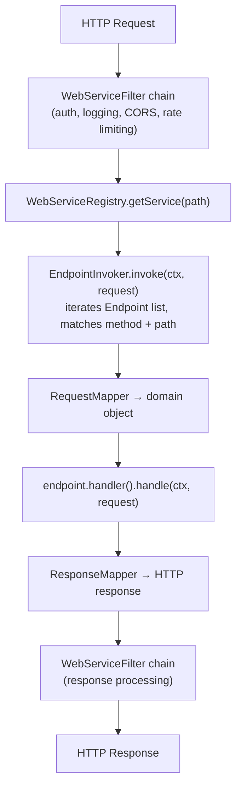

# Web Services Module — Architecture

## Module Purpose

The web-services module provides web service components that plug into the HTTP module. It defines the abstractions for building, registering, and routing web services with content negotiation and pluggable codecs. Built on the blocks DP/DF framework and service lifecycle model.

## Package Structure

```
ssg.legoflow.ws/
├── WebService                    — top-level web service abstraction
├── WebServiceRegistry            — service discovery and lookup
├── AsyncWebService               — async wrapper returning CompletableFuture (virtual threads)
├── AsyncWebServiceRegistry       — async wrapper for service registry
├── WebServiceFilter              — chainable request/response filter
├── WebServiceDescriptor          — service metadata
├── WebServiceContext             — web-aware context (method, path, headers, params)
├── request/
│   ├── RequestMapper             — HTTP request → domain object
│   └── ResponseMapper            — domain object → HTTP response
├── content/
│   ├── ContentNegotiator         — selects best codec from Accept/Content-Type headers
│   │                               (q-factor parsing, specificity tiebreaking, wildcard handling)
│   ├── JsonCodec                 — JSON serialization/deserialization
│   └── XmlCodec                  — XML serialization/deserialization
├── endpoint/
│   ├── Endpoint                  — HTTP method + path pattern route
│   ├── EndpointInvoker           — endpoint execution logic
│   └── AsyncEndpointInvoker      — async wrapper for endpoint invocation
└── demo/
    ├── HelloWorldService         — minimal web service demo
    ├── TodoApiService            — CRUD API demo with multiple endpoints
    ├── UserApiService            — realistic CRUD API with JSON + XML codecs
    ├── MultiFormatService        — serves JSON, XML, and plain-text based on Accept header
    ├── CompositeApiServer        — multiple services behind a single WebServiceRegistry
    └── DemoWebServicesAll        — comprehensive demo of all web services features
```

## Data Flow



## Content Negotiation Design

Content negotiation is handled by the standalone `ContentNegotiator` class, which is invoked by `WebService` during request processing. Separating negotiation logic from the service allows independent testing and reuse across services.

### ContentNegotiator Algorithm

1. **Request**: `Content-Type` header determines which codec deserializes the request body
2. **Response**: `Accept` header determines which codec serializes the response body — algorithm:
   a. Parse `Accept` header into media-type + q-factor pairs
   b. Sort by q-factor descending (ties broken by specificity: exact > partial wildcard > `*/*`)
   c. Match each client preference against the service's registered codecs in preference order
   d. Return the first match; if none, respond 406 Not Acceptable
3. **Fallback**: if `Accept` is absent or `*/*`, the first registered codec is used

Codecs are registered per web service and are independent, pluggable components:
- `JsonCodec` — handles `application/json`
- `XmlCodec` — handles `application/xml`, `text/xml`
- Custom codecs implement the same interface for additional content types

## Design Patterns

- **Registry** — `WebServiceRegistry` for service discovery and lookup
- **Chain of Responsibility** — `WebServiceFilter` chain for request/response processing
- **Strategy** — pluggable codecs and mappers selected at runtime
- **Template Method** — inherited from blocks/service DP/DF pattern

## Dual API Approach

- **Sync procedural** — `webService.handle(ctx, request)`, `registry.getService(path)`
- **Async wrapper** — `AsyncWebService`, `AsyncWebServiceRegistry`, `AsyncEndpointInvoker` return `CompletableFuture<T>`, delegating to sync on virtual threads via `Executors.newVirtualThreadPerTaskExecutor()`
- **Functional style** — lambda-friendly endpoint builders, composable filter chains, codec registration via fluent API

### Wrapper Pattern (Async)

The sync API is the primary implementation. JDK 25 virtual threads make blocking calls near-zero-cost, so sync APIs are simpler to write, debug, and test. The async wrappers (`AsyncWebService`, `AsyncWebServiceRegistry`, `AsyncEndpointInvoker`) exist for callers who need `CompletableFuture` composability --- for example, combining web service results with other async operations, building reactive pipelines, or integrating with frameworks that expect `CompletableFuture`-based APIs.

Each async wrapper:
1. Holds a reference to the sync delegate
2. Creates a `newVirtualThreadPerTaskExecutor()` (or accepts a custom `ExecutorService`)
3. Wraps each sync call in `CompletableFuture.supplyAsync()` / `runAsync()`
4. Exposes a `sync()` method for direct access to the delegate

## Extension Points

- Custom `WebService` implementations (implement the `WebService` interface directly)
- Custom `WebServiceFilter` implementations for cross-cutting concerns
- Custom content codecs (implement codec interface for new content types) — automatically picked up by `ContentNegotiator`
- Custom `RequestMapper` / `ResponseMapper` for specialized transformations
- Custom `EndpointInvoker` implementations for non-standard endpoint logic
- Custom `WebServiceRegistry` implementations for alternative discovery mechanisms

---

## Related Documentation

- [Module README](../README.md) | [Requirements](REQUIREMENTS.md)
- [Root Architecture](../../doc/ARCHITECTURE.md) | [Root README](../../README.md)

---

**Last Updated**: 2026-07-07
